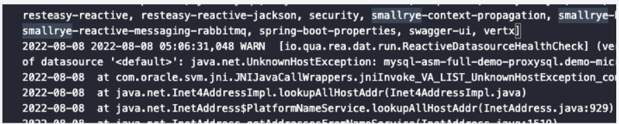
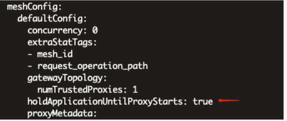

---
kind:
  - Troubleshooting
products:
  - Alauda Container Platform
  - Alauda DevOps
  - Alauda AI
  - Alauda Application Services
  - Alauda Service Mesh
  - Alauda Developer Portal
ProductsVersion:
  - 4.1.0,4.2.x
---
<!-- A type of document that involves encountering a fault, diagnosing it, performing root cause analysis, and providing solutions. -->

# SideCar注入会影响服务访问mgr数据库

服务无法访问mgr数据库 移除sidecar透传annotation后仍存在报错

## Cause
- 应用启动时sidecar尚未就绪

## Resolution
- 升级至Istio 1.12并配置应用启动顺序设置

## [workaround]

## [Related Information]
**Screenshots**

- Environment: 3.8,1
- mgr数据库的mysql服务
- sidecar透传annotation
- holdApplicationUntilProxyStarts
- Component: MySQL/PXC
- Page ID: 123602255
- Original Title: SideCar注入会影响服务访问mgr数据库
