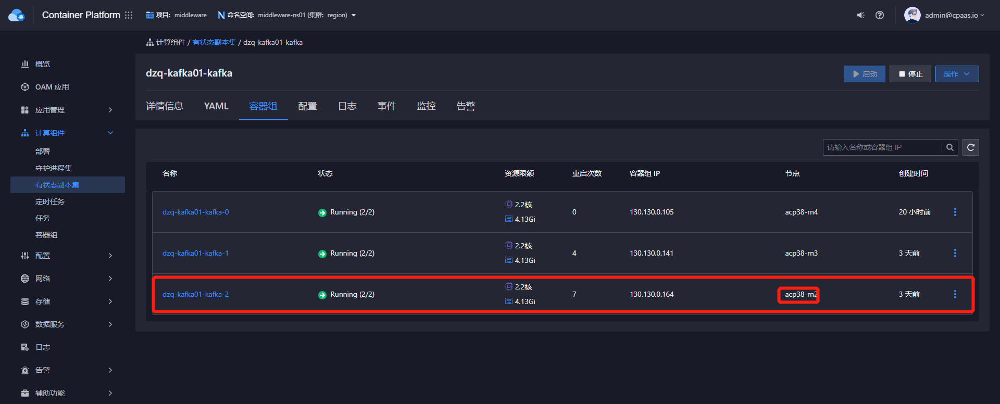
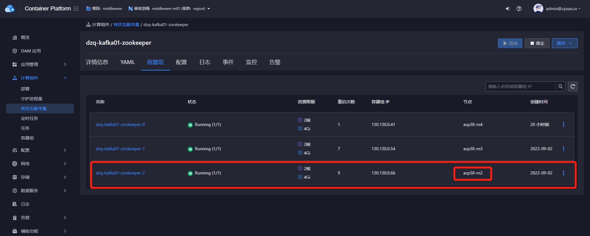
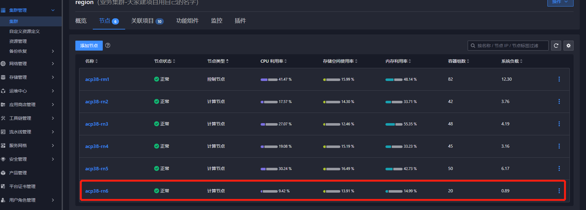
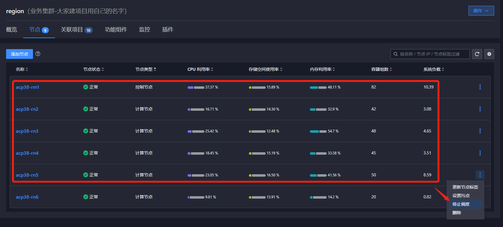

---
kind:
  - Troubleshooting
products:
  - Alauda Container Platform
  - Alauda DevOps
  - Alauda AI
  - Alauda Application Services
  - Alauda Service Mesh
  - Alauda Developer Portal
ProductsVersion:
  - 4.1.0,4.2.x
---
<!-- A type of document that involves encountering a fault, diagnosing it, performing root cause analysis, and providing solutions. -->

# 中间件

## 环境信息 适用版本：3.8.0 3.8.1 3.8.2

## Cause

## Resolution
- 确认迁移实例所在节点: kubectl get pod -A -owide |egrep 'dzq-kafka01-zookeeper-2|dzq-kafka01-kafka-2'
- 准备存储类型: 确保使用topolvm存储
- 设置节点调度策略: 仅允许目标节点调度
- 删除Zookeeper实例PVC和Pod: kubectl delete pvc -nmiddleware-ns01 data-dzq-kafka01-zookeeper-2 && kubectl delete pod -nmiddleware-ns01 dzq-kafka01-zookeeper-2
- 删除Kafka实例PVC和Pod: kubectl delete pvc -nmiddleware-ns01 data-dzq-kafka01-kafka-2 && kubectl delete pod -nmiddleware-ns01 dzq-kafka01-kafka-2
- 验证迁移结果: kubectl get pod -A -owide |grep 'data-dzq-kafka01-zookeeper-2|dzq-kafka01-kafka-2'
- 恢复节点调度策略

## [workaround]

## [Related Information]
**Screenshots**

- Environment: Kafka 3.8.0/3.8.1/3.8.2
- data-dzq-kafka01-zookeeper-2
- data-dzq-kafka01-kafka-2
- sc-topolvm
- middleware-ns01
- kubectl delete pvc
- kubectl delete pod
- Component: MySQL/PXC
- Page ID: 124700787
- Original Title: 中间件-Kakfa-服务实例节点迁移方案
