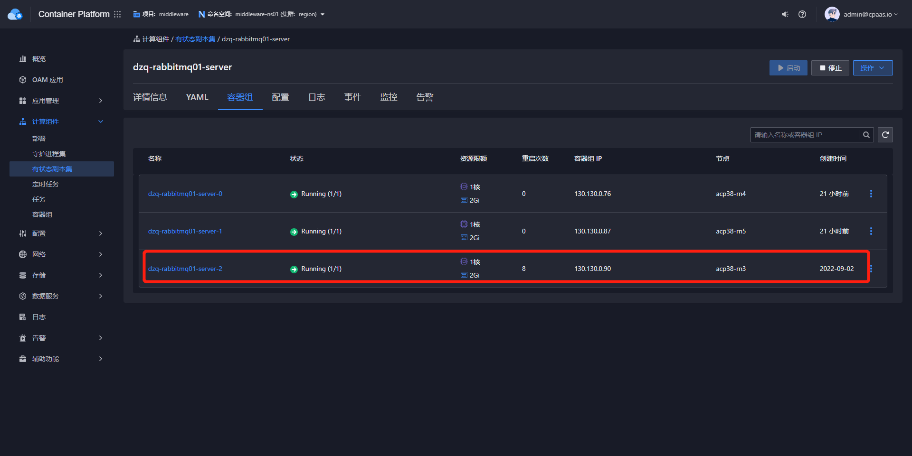
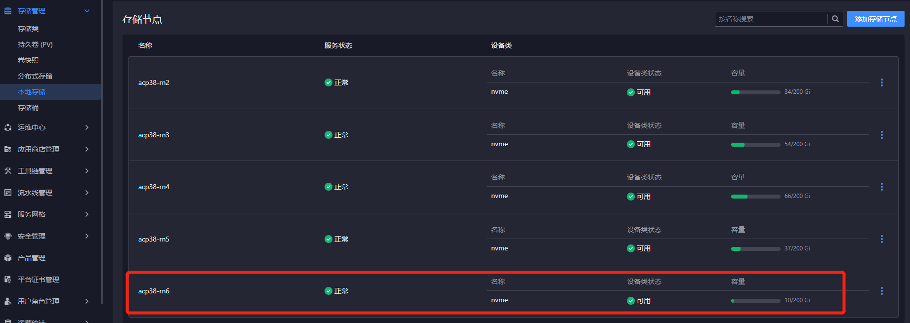
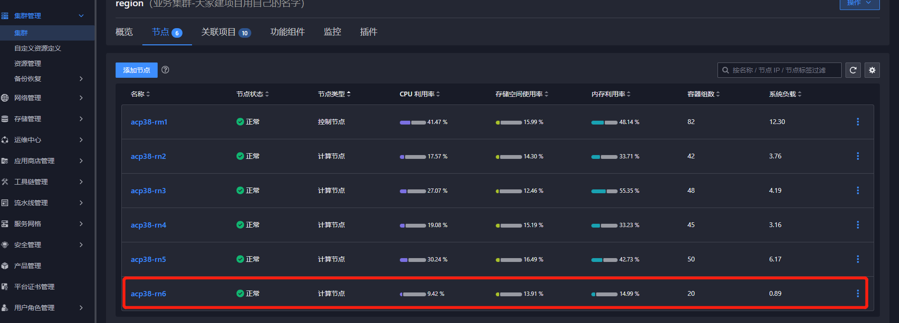
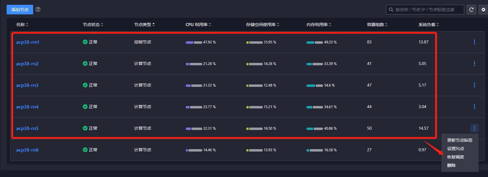

---
kind:
  - Troubleshooting
products:
  - Alauda Container Platform
  - Alauda DevOps
  - Alauda AI
  - Alauda Application Services
  - Alauda Service Mesh
  - Alauda Developer Portal
ProductsVersion:
  - 4.1.0,4.2.x
---
<!-- A type of document that involves encountering a fault, diagnosing it, performing root cause analysis, and providing solutions. -->

# 中间件

## 环境信息 适用版本：3.8.0 3.8.1 3.8.2

## Cause

## Resolution
- 删除PVC persistence-dzq-rabbitmq01-server-2
- 删除Pod dzq-rabbitmq01-server-2
- 调整节点调度标签确保Pod迁移到目标节点

## [workaround]

## [Related Information]
**Screenshots**

- Environment: RabbitMQ 3.8.0, 3.8.1, 3.8.2
- persistence-dzq-rabbitmq01-server-2
- dzq-rabbitmq01-server-2
- kubectl delete pvc
- kubectl delete pod
- topolvm存储
- 节点调度标签
- Component: MySQL/PXC
- Page ID: 124700823
- Original Title: 中间件-RabbitMQ-服务实例节点迁移方案
