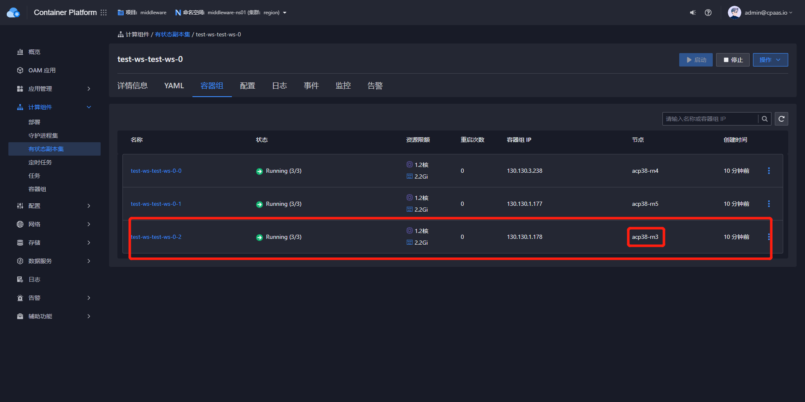
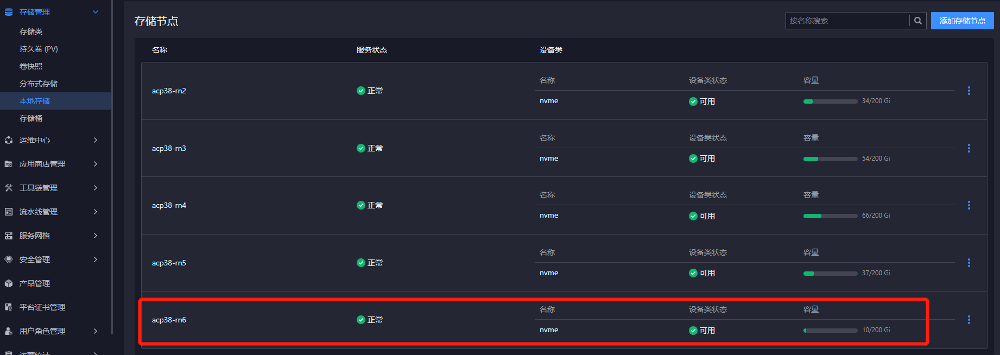
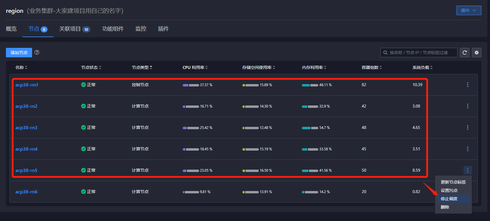
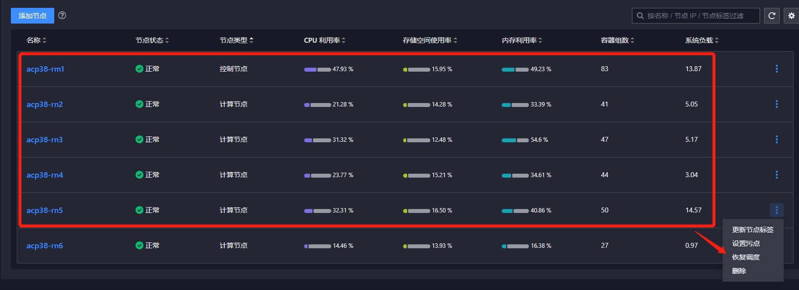

---
kind:
  - Troubleshooting
products:
  - Alauda Container Platform
  - Alauda DevOps
  - Alauda AI
  - Alauda Application Services
  - Alauda Service Mesh
  - Alauda Developer Portal
ProductsVersion:
  - 4.1.0,4.2.x
---
<!-- A type of document that involves encountering a fault, diagnosing it, performing root cause analysis, and providing solutions. -->

# 中间件

## 环境信息 适用版本：3.8.0 3.8.1 3.8.2

## Cause

## Resolution
- 确认需迁移的MongoDB实例节点位置
- 确保目标节点存储可用性（topolvm存储）
- 设置非目标节点为不可调度，仅保留目标节点可调度
- 删除原PVC：kubectl delete pvc -nmiddleware-ns01 mongod-data-test-ws-test-ws-0-2
- 删除原Pod：kubectl delete pod -nmiddleware-ns01 test-ws-test-ws-0-2
- 验证新Pod是否迁移至目标节点：kubectl get pod -A -owide | grep test-ws-test-ws-0-2
- 检查数据库状态：mongo进入实例执行db.stats()
- 恢复非目标节点调度

## [workaround]

## [Related Information]
**Screenshots**

- Environment: 3.8.0-3.8.2
- PVC
- Pod
- kubectl delete pvc
- kubectl delete pod
- topolvm
- db.stats()
- 节点调度标签
- Component: MySQL/PXC
- Page ID: 124700887
- Original Title: 中间件-MongoDB-服务实例节点迁移方案
