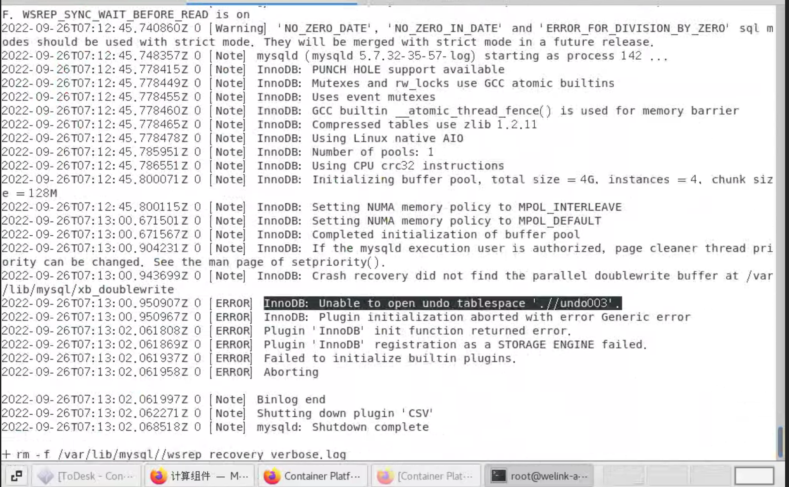
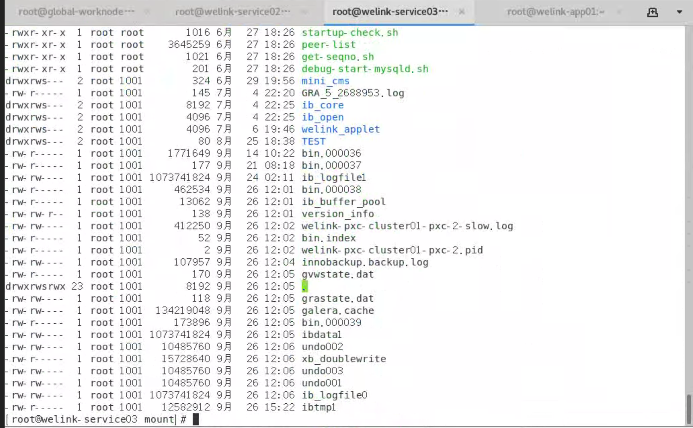

---
kind:
  - Troubleshooting
products:
  - Alauda Container Platform
  - Alauda DevOps
  - Alauda AI
  - Alauda Application Services
  - Alauda Service Mesh
  - Alauda Developer Portal
ProductsVersion:
  - 4.1.0,4.2.x
---
<!-- A type of document that involves encountering a fault, diagnosing it, performing root cause analysis, and providing solutions. -->

# pxc集群异常

pxc0和pxc1无法启动 报错找不到undo3文件 pxc0/1的PVC中缺少undo03文件

## Cause
- innodb_undo_tablespaces参数从默认值3被修改为2
- 参数变更导致已有undo表空间文件不匹配

## Resolution
- 修改部署参数innodb_undo_tablespaces=3
- 将正常节点(pxc03)的undo3文件复制到pxc-0的PVC目录
- 调整集群size=1等待单节点启动
- 复制undo3到pxc-1目录后重启
- 最终恢复集群size=3

## [workaround]

## [Related Information]
**Screenshots**

- Environment: 3.8.1
- innodb_undo_tablespaces
- pxc集群PVC目录
- undo表空间文件(undo01/undo02/undo03)
- Component: MySQL/PXC
- Page ID: 127427995
- Original Title: pxc集群异常
