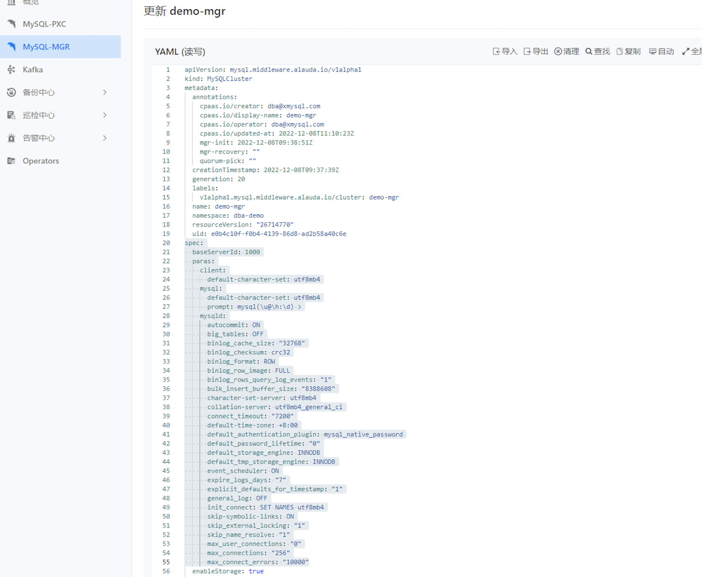

---
kind:
  - Troubleshooting
products:
  - Alauda Container Platform
  - Alauda DevOps
  - Alauda AI
  - Alauda Application Services
  - Alauda Service Mesh
  - Alauda Developer Portal
ProductsVersion:
  - 4.1.0,4.2.x
---
<!-- A type of document that involves encountering a fault, diagnosing it, performing root cause analysis, and providing solutions. -->

# 3.10版本修改mgr参数信息

客户连接数不足

## Cause
- mgr默认连接数配置为151

## Resolution
- 在mgr的CR配置中通过paras字段添加max_connections参数

## [workaround]

## [Related Information]
**Screenshots**

- Environment: 3.10
- paras
- mysqld.max_connections
- CR配置
- Component: MySQL/PXC
- Page ID: 133076117
- Original Title: 3.10版本修改mgr参数信息
