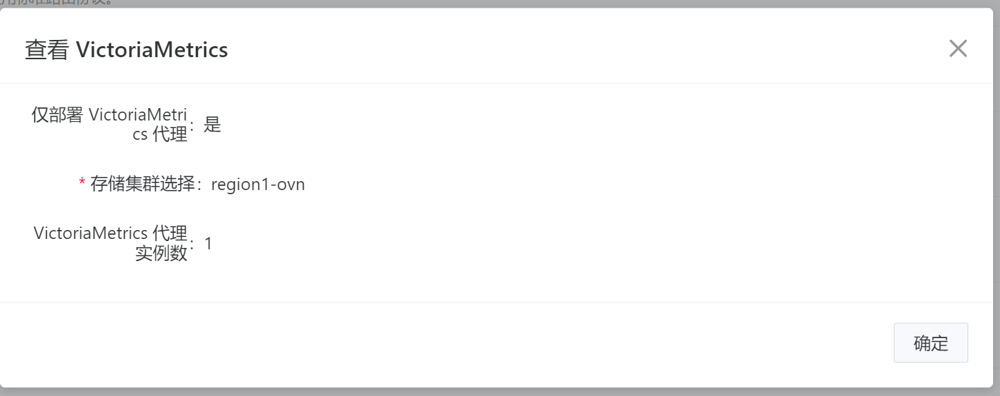
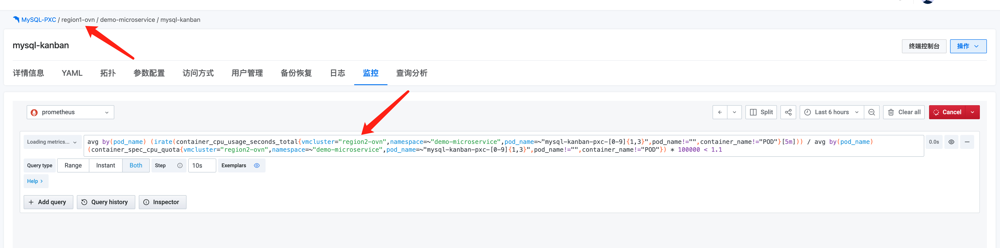
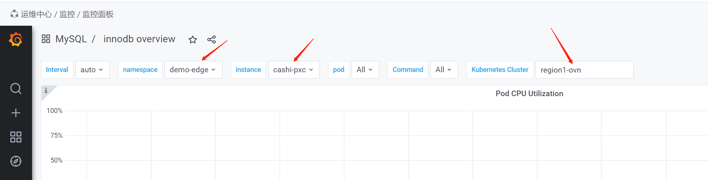
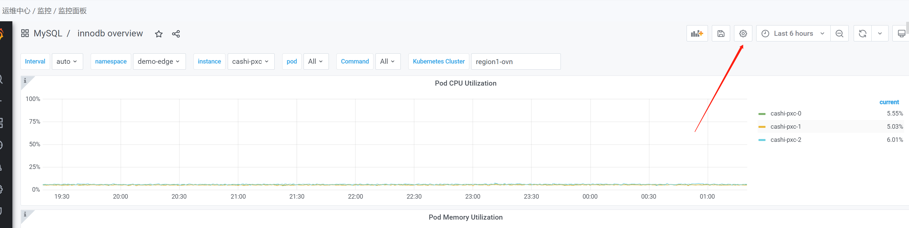
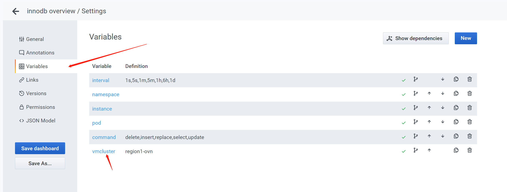
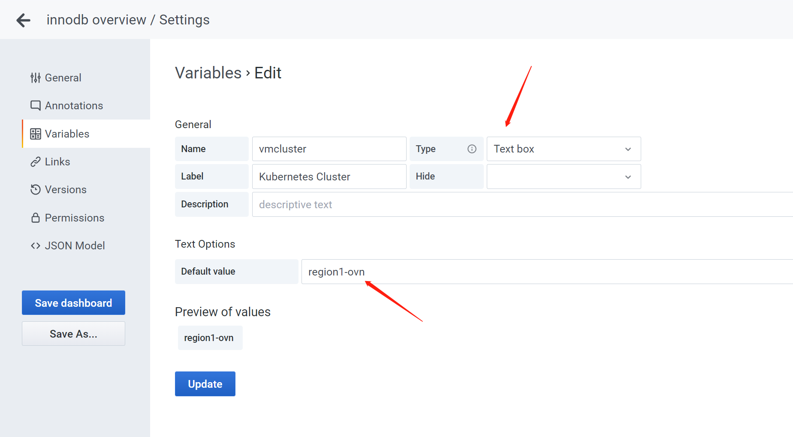

---
kind:
  - Troubleshooting
products:
  - Alauda Container Platform
  - Alauda DevOps
  - Alauda AI
  - Alauda Application Services
  - Alauda Service Mesh
  - Alauda Developer Portal
ProductsVersion:
  - 4.1.0,4.2.x
---
<!-- A type of document that involves encountering a fault, diagnosing it, performing root cause analysis, and providing solutions. -->

# pxc没有监控数据

PXC监控数据无法加载

## Cause
- 监控查询表达式配置错误

## Resolution
- 手动修改Grafana的dashboard配置：修改Variables->vmcluster的Type为Text box，Text Options设置为当前PXC所在集群名称

## [workaround]

## [Related Information]
**Screenshots**

- Environment: 3.10.x版本，使用vm监控且跨集群存储（region2-ovn使用region1-ovn的vm监控）
- grafana
- vmcluster
- innodb overview
- 监控面板
- 命名空间
- Component: MySQL/PXC
- Page ID: 133094615
- Original Title: pxc没有监控数据
