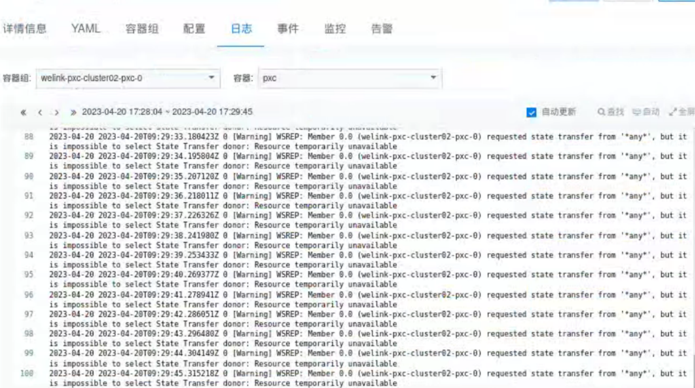

---
kind:
  - Troubleshooting
products:
  - Alauda Container Platform
  - Alauda DevOps
  - Alauda AI
  - Alauda Application Services
  - Alauda Service Mesh
  - Alauda Developer Portal
ProductsVersion:
  - 4.1.0,4.2.x
---
<!-- A type of document that involves encountering a fault, diagnosing it, performing root cause analysis, and providing solutions. -->

# pxc一直处于处理中

pxc一直处于处理中 pxc实例日志报错requested state transfer from"any"", but itmpossible to select State Transfer donor: Resource temporarily unavailabl

## Cause
- SST完成后数据差异无法通过gcache进行IST追上，需要重新SST
- 数据量越大、网络带宽、磁盘IO导致恢复时间过长

## Resolution
- 调整gcache大小并开启gcache_recovery
- 通过yaml方式编辑pxc实例新增配置后触发重启

## [workaround]

## [Related Information]
**Screenshots**

- Environment: 3.8.2
- gcache
- gcache_recovery
- pxc实例
- Component: MySQL/PXC
- Page ID: 146354634
- Original Title: pxc一直处于处理中-pxc实例日志报错requested state transfer from"any"", but itmpossible to select State Transfer donor: Resource temporarily unavailabl
