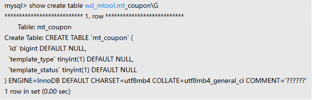

---
kind:
  - Troubleshooting
products:
  - Alauda Container Platform
  - Alauda DevOps
  - Alauda AI
  - Alauda Application Services
  - Alauda Service Mesh
  - Alauda Developer Portal
ProductsVersion:
  - 4.1.0,4.2.x
---
<!-- A type of document that involves encountering a fault, diagnosing it, performing root cause analysis, and providing solutions. -->

# mgr异常，日志报错 {"error":"The following tables do not have a Primary Key or equivalent column: \n"}

mgr异常，日志报错 {"error":"The following tables do not have a Primary Key or equivalent column: \n"} 涉及表：wd_mtool.mt_coupon, wd_mtool.mt_coupon_template

## Cause
- MGR集群中的wd_mtool.mt_coupon和wd_mtool.mt_coupon_template表缺少主键或等效非空唯一键
- 当表插入数据后重启mgr时触发异常

## Resolution
- 执行ALTER TABLE语句为缺失主键的表添加主键列：
ALTER TABLE mytable ADD COLUMN new_col INT NOT NULL AUTO_INCREMENT PRIMARY KEY;
- 操作前需备份数据并确保无重复值

## [workaround]

## [Related Information]
**Screenshots**

- Environment: 3.10.2
- wd_mtool.mt_coupon
- wd_mtool.mt_coupon_template
- Group Replication
- InnoDB
- PRIMARY KEY
- Component: MySQL/PXC
- Page ID: 146355254
- Original Title: mgr异常，日志报错 {"error":"The following tables do not have a Primary Key or equivalent column: \n"}
