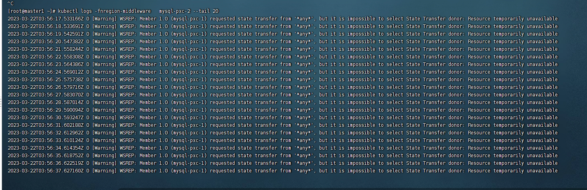

---
kind:
  - Troubleshooting
products:
  - Alauda Container Platform
  - Alauda DevOps
  - Alauda AI
  - Alauda Application Services
  - Alauda Service Mesh
  - Alauda Developer Portal
ProductsVersion:
  - 4.1.0,4.2.x
---
<!-- A type of document that involves encountering a fault, diagnosing it, performing root cause analysis, and providing solutions. -->

# 3.6

恢复过程中待恢复的pod重启，无法完成节点恢复

## Cause
- 健康检查在SST(State Snapshot Transfer)期间失败导致pod被终止

## Resolution
- 等待SST完成后删除临时健康检查绕过文件
- 通过命令`ls /var/lib/mysql/.sst`确认SST状态

## [workaround]
- 在待恢复节点容器内执行`touch /tmp/recovery-case`临时绕过健康检查
- 使用`kubectl exec`进入容器进行操作

## [Related Information]
**Screenshots**

- Environment: 3.6.x
- /tmp/recovery-case
- /var/lib/mysql/.sst
- kubectl exec
- 健康检查机制
- WSREP
- SST(State Snapshot Transfer)
- Component: MySQL/PXC
- Page ID: 146355500
- Original Title: 3.6-MySQL-PXC 大数据量恢复时被健康检查中断
