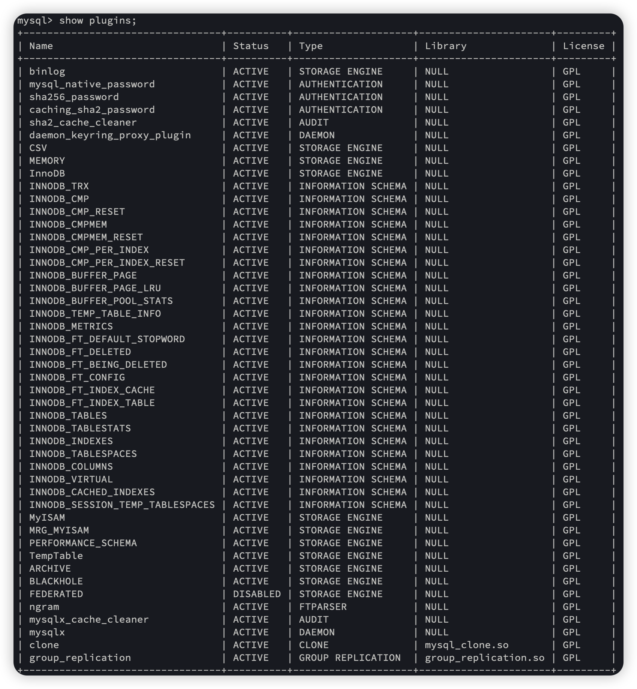
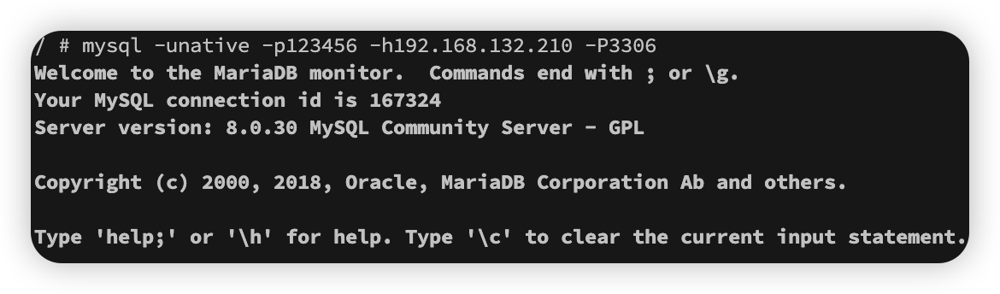
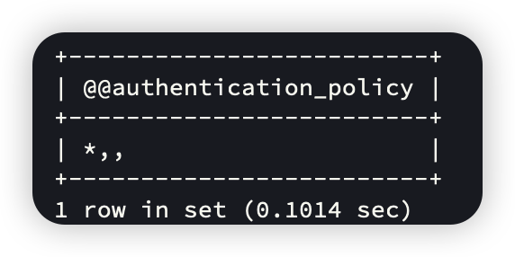
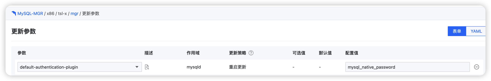

---
kind:
  - Troubleshooting
products:
  - Alauda Container Platform
  - Alauda DevOps
  - Alauda AI
  - Alauda Application Services
  - Alauda Service Mesh
  - Alauda Developer Portal
ProductsVersion:
  - 4.1.0,4.2.x
---
<!-- A type of document that involves encountering a fault, diagnosing it, performing root cause analysis, and providing solutions. -->

# 3.12

客户端连接失败提示：密码插件不匹配，无法使用 caching_sha2_password 连接

## Cause
- 旧版客户端不支持 MySQL 8.0 默认的 caching_sha2_password 认证插件

## Resolution
- 新建用户时指定加密插件：CREATE USER '<user>'@'<host>' IDENTIFIED WITH mysql_native_password BY '<password>'
- 修改已有用户认证方式：创建新用户并迁移权限后删除原用户
- 修改 MySQL 参数 default_authentication_plugin 为 mysql_native_password（适用于 8.0.27 之前版本）

## [workaround]

## [Related Information]
**Screenshots**

- Environment: 3.12.x
- mysql_native_password
- caching_sha2_password
- default_authentication_plugin
- authentication_policy
- Component: MySQL/PXC
- Page ID: 146357535
- Original Title: 3.12-MySQL-MGR 使用 mysql_native_password 加密插件的手工方案
