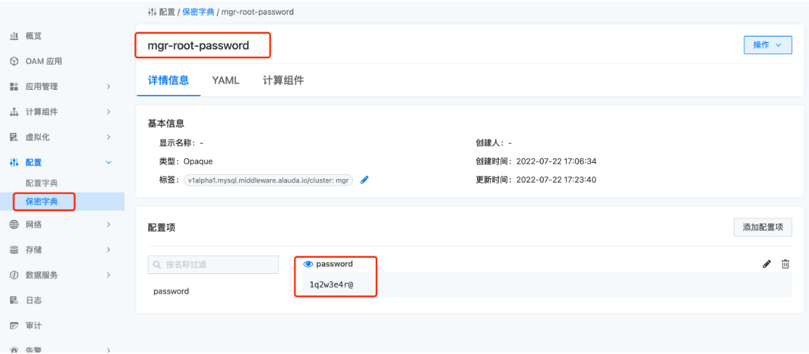
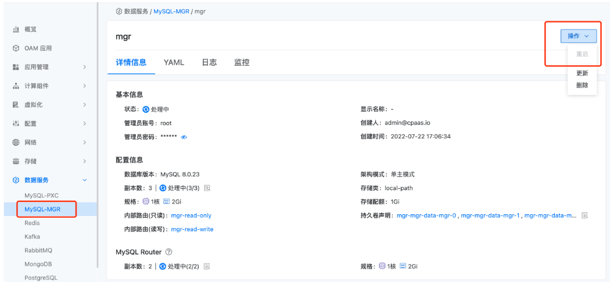

---
kind:
  - Troubleshooting
products:
  - Alauda Container Platform
  - Alauda DevOps
  - Alauda AI
  - Alauda Application Services
  - Alauda Service Mesh
  - Alauda Developer Portal
ProductsVersion:
  - 4.1.0,4.2.x
---
<!-- A type of document that involves encountering a fault, diagnosing it, performing root cause analysis, and providing solutions. -->

# MGR修改密码方案

实例启动失败

## Cause
- 修改密码前进行mysql pod缩减操作导致新老密码冲突

## Resolution
- 通过ALTER USER命令修改mysql root密码
- 更新{实例名称}-root-password保密字典的password字段
- 在容器平台重启MGR实例

## [workaround]

## [Related Information]
**Screenshots**

- Environment: 3.6,3.8,3.10,3.12
- 保密字典
- mysql pod
- MGR实例
- ALTER USER
- {实例名称}-root-password
- Component: MySQL/PXC
- Page ID: 146364930
- Original Title: 数据服务-MGR修改密码方案
