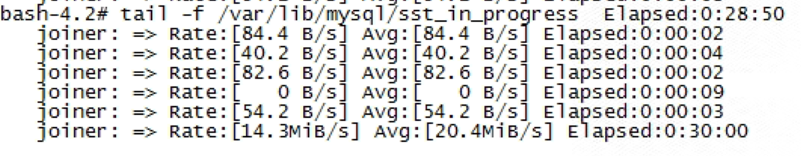

---
kind:
  - Troubleshooting
products:
  - Alauda Container Platform
  - Alauda DevOps
  - Alauda AI
  - Alauda Application Services
  - Alauda Service Mesh
  - Alauda Developer Portal
ProductsVersion:
  - 4.1.0,4.2.x
---
<!-- A type of document that involves encountering a fault, diagnosing it, performing root cause analysis, and providing solutions. -->

# 微甄容器底座 排查PXC启动失败

pxc operator异常，operator被删除 operator日志报错'a backup image should be set in the PXC config' WSREP报错'failed to reach primary view (pc.wait_prim_timeout): 110 (Connection timed out)'

## Cause
- operator被意外删除导致控制平面失效
- PXC配置中缺少备份镜像定义
- 节点间网络通信超时导致集群组建失败
- gcache配置过小且未开启gcache_recovery
- 节点启动顺序异常导致NO_PRIMARY状态

## Resolution
- 重新部署pxc operator
- 在PXC配置中设置有效备份镜像
- 手动执行bootstrap流程选择最大事务ID节点
- 调整gcache.size=2G并开启gcache.recover=yes
- 强制指定bootstrap节点后逐步扩展集群规模

## [workaround]
- 使用'sleep infinity'启动容器暂停自动恢复
- 修改statefulset配置绕过operator控制
- 手动执行/var/lib/mysql/pxc-entrypoint.sh启动进程

## [Related Information]
**Screenshots**
参考[10msqa.md](https://confluence.alauda.cn/download/attachments/144905528/10msqa.md?version=1&modificationDate=1681281983000&api=v2)

- Environment: ACP3.4.2版本，PXC规格4C8G，PVC容量800G，计算节点容器启动时间42小时
- perconaxtradbclusterbackup-controller
- gcomm://IP列表
- wsrep_cluster_address
- pxc-entrypoint.sh
- gcache.size配置项
- Component: MySQL/PXC
- Page ID: 151885846
- Original Title: 微甄容器底座 排查PXC启动失败
