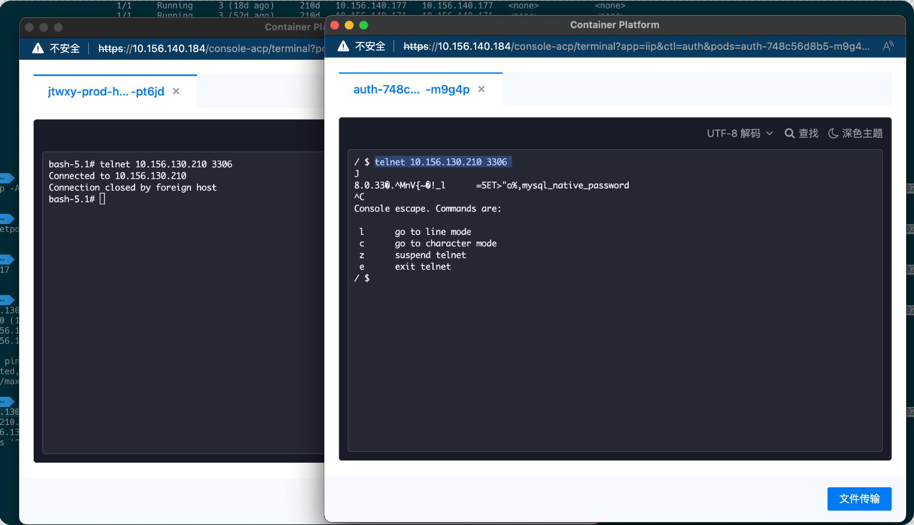

---
kind:
  - Troubleshooting
products:
  - Alauda Container Platform
  - Alauda DevOps
  - Alauda AI
  - Alauda Application Services
  - Alauda Service Mesh
  - Alauda Developer Portal
ProductsVersion:
  - 4.1.0,4.2.x
---
<!-- A type of document that involves encountering a fault, diagnosing it, performing root cause analysis, and providing solutions. -->

# 容器连接不上外部ip

pod内无法访问外部mysql ip 重启过的pod无法访问外部mysql，未重启的pod正常 宿主机可以访问外部mysql ip和端口

## Cause
- kube-ovn-controller未能连接到ovn数据库
- kube-ovn-controller同步数据不完整

## Resolution
- 重启kube-ovn-controller的3个pod

## [workaround]

## [Related Information]
**Screenshots**

- Environment: TKE 3.10.2, CentOS 7.9
- kube-ovn-controller
- ovn db
- TKE 3.10.2
- Component: MySQL/PXC
- Page ID: 152657555
- Original Title: 容器连接不上外部ip
