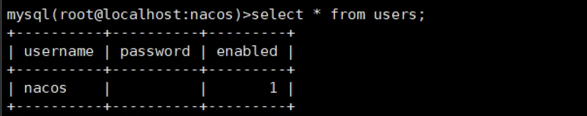

---
kind:
  - Troubleshooting
products:
  - Alauda Container Platform
  - Alauda DevOps
  - Alauda AI
  - Alauda Application Services
  - Alauda Service Mesh
  - Alauda Developer Portal
ProductsVersion:
  - 4.1.0,4.2.x
---
<!-- A type of document that involves encountering a fault, diagnosing it, performing root cause analysis, and providing solutions. -->

# 使用默认密码登录nacos提示密码不正确

使用默认密码nacos/nacos登录时提示账户或密码错误

## Cause
- 用户表中`password`字段为空，导致无法验证

## Resolution
- 执行SQL插入用户记录：`INSERT INTO users (username, password, enabled) VALUES ('nacos', '$2a$10$EuWPZHzz32dJN7jexM34MOeYirDdFAZm2kuWj7VEOJhhZkDrxfvUu', TRUE);`
- 执行SQL插入角色记录：`INSERT INTO roles (username, role) VALUES ('nacos', 'ROLE_ADMIN');`
- 重启nacos服务

## [workaround]

## [Related Information]
**Screenshots**

- Environment: Nacos 3.8/3.10/3.12
- users表
- roles表
- nacos数据库
- mysql
- Component: MySQL/PXC
- Page ID: 163078224
- Original Title: 使用默认密码登录nacos提示密码不正确
