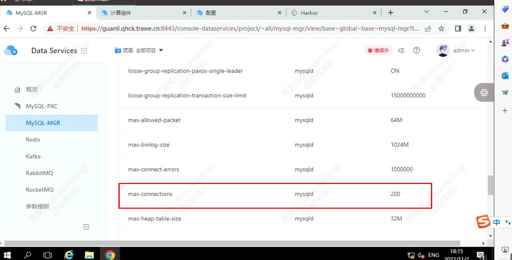
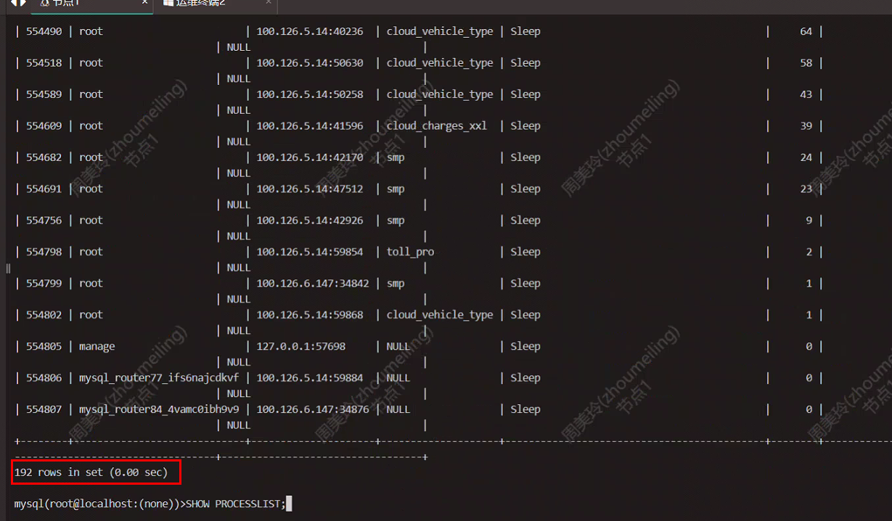

---
kind:
  - Troubleshooting
products:
  - Alauda Container Platform
  - Alauda DevOps
  - Alauda AI
  - Alauda Application Services
  - Alauda Service Mesh
  - Alauda Developer Portal
ProductsVersion:
  - 4.1.0,4.2.x
---
<!-- A type of document that involves encountering a fault, diagnosing it, performing root cause analysis, and providing solutions. -->

# mgr

mgr-mysql实例提示连接数过大 当前连接数接近或达到200

## Cause
- 最大连接数参数设置过低（当前设置为200）

## Resolution
- 通过管理界面将max_connections参数调整为500，并手动重启实例使配置生效

## [workaround]
- 重启mysql实例以临时释放连接

## [Related Information]
**Screenshots**

- Environment: 3.12.*
- max_connections
- MGR
- mgr-mysql实例
- Component: MySQL/PXC
- Page ID: 168321042
- Original Title: mgr-mysql实例提示连接数过大-mgr-mysql实例最大连接数调整方法
