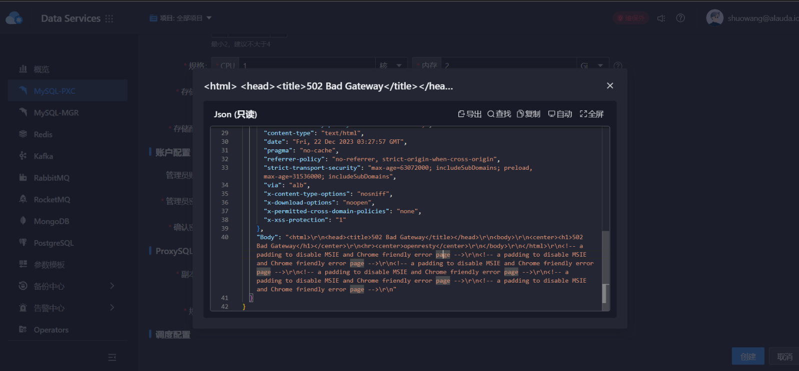

---
kind:
  - Troubleshooting
products:
  - Alauda Container Platform
  - Alauda DevOps
  - Alauda AI
  - Alauda Application Services
  - Alauda Service Mesh
  - Alauda Developer Portal
ProductsVersion:
  - 4.1.0,4.2.x
---
<!-- A type of document that involves encountering a fault, diagnosing it, performing root cause analysis, and providing solutions. -->

# 3.14.0

创建pxc时报错502 erebus服务pod返回502错误 erebus容器存在重启行为

## Cause
- 3.14.0版本erebus服务触发空指针异常
- 3.14.0版本已知问题

## Resolution
- 替换erebus镜像为cloud-registry.alauda.cn/ait/erebus:v3.14.6

## [workaround]

## [Related Information]
**Screenshots**

- Environment: 3.14.0版本，涉及pxc和mongodb组件
- erebus
- alb
- nginx
- global集群
- cloud-registry.alauda.cn/ait/erebus
- Component: MySQL/PXC
- Page ID: 178229142
- Original Title: 3.14.0-创建pxc报错502
