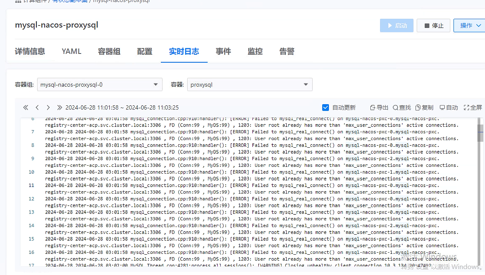
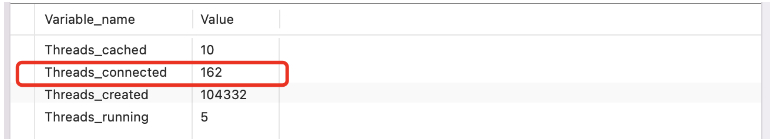
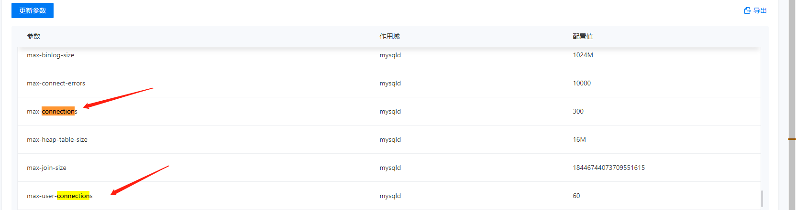
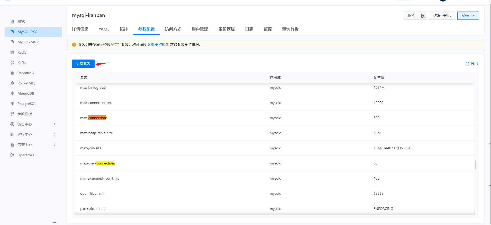

---
kind:
  - Troubleshooting
products:
  - Alauda Container Platform
  - Alauda DevOps
  - Alauda AI
  - Alauda Application Services
  - Alauda Service Mesh
  - Alauda Developer Portal
ProductsVersion:
  - 4.1.0,4.2.x
---
<!-- A type of document that involves encountering a fault, diagnosing it, performing root cause analysis, and providing solutions. -->

# mysql

proxysql->pxc异常，单用户最大连接数超出上限

## Cause
- 单个数据库用户的连接数超过max_user_connections限制

## Resolution
- 通过平台参数修改mysql.user表中对应用户的max_user_connections值
- 重启mysql服务使配置生效

## [workaround]

## [Related Information]
**Screenshots**

修改后需重启mysql服务
- Environment: ACP3.12+
- max_user_connections
- mysql.user
- proxysql
- 3306
- show global status
- SHOW VARIABLES LIKE 'max_connections'
- Component: MySQL/PXC
- Page ID: 217559524
- Original Title: mysql-pxc 数据库单用户最大连接数超出
