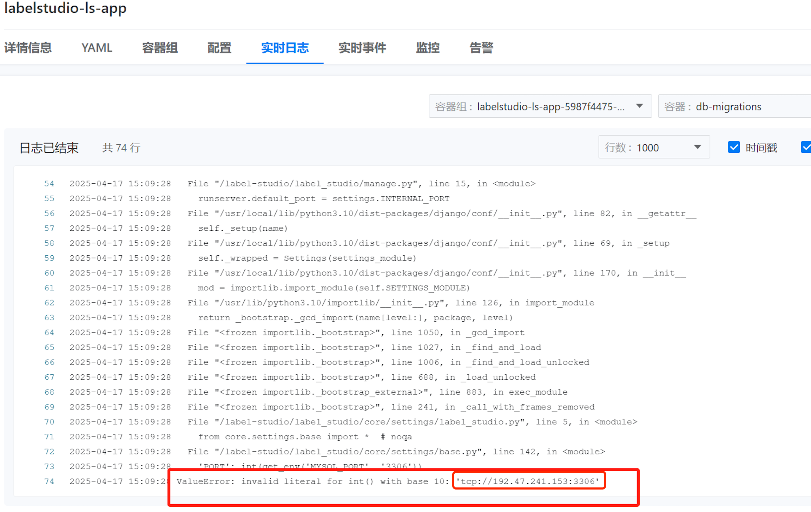

---
kind:
  - Troubleshooting
products:
  - Alauda Container Platform
  - Alauda DevOps
  - Alauda AI
  - Alauda Application Services
  - Alauda Service Mesh
  - Alauda Developer Portal
ProductsVersion:
  - 4.1.0,4.2.x
---
<!-- A type of document that involves encountering a fault, diagnosing it, performing root cause analysis, and providing solutions. -->

# labelstudio 部署问题

mysql port 解析失败

## Cause
- kubeflow ns 下已部署内置mysql，svc环境变量冲突导致MYSQL_PORT异常

## Resolution
- 更换命名空间部署
- 修改podSpec设置enableServiceLinks: false

## [workaround]

## [Related Information]
**Screenshots**

- Environment: kubeflow 命名空间
- mysql
- svc
- MYSQL_PORT
- enableServiceLinks
- Component: MySQL/PXC
- Page ID: 277807625
- Original Title: labelstudio 部署问题
