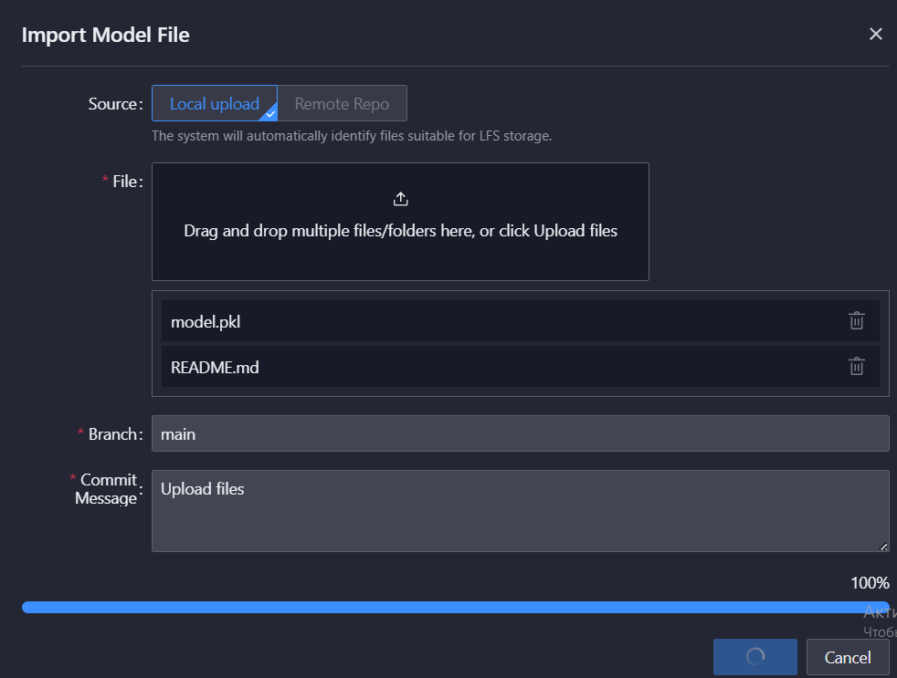
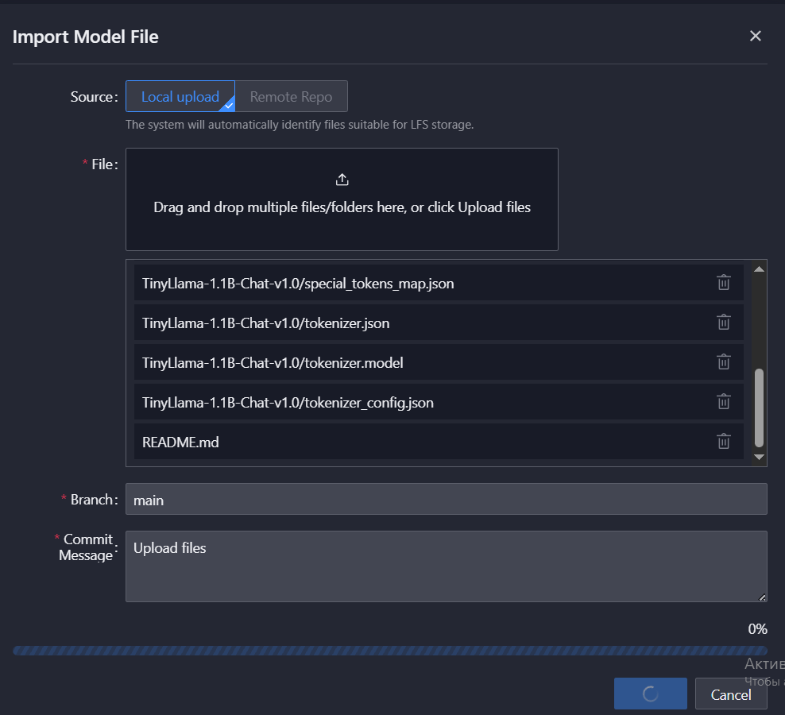

---
kind:
  - Troubleshooting
products:
  - Alauda Container Platform
  - Alauda DevOps
  - Alauda AI
  - Alauda Application Services
  - Alauda Service Mesh
  - Alauda Developer Portal
ProductsVersion:
  - 4.1.0,4.2.x
---
<!-- A type of document that involves encountering a fault, diagnosing it, performing root cause analysis, and providing solutions. -->

# AlaudaAI technical failures

Error occurs when deleting a repository (file delete_error.txt) Other LLMs (Hugging Face, pkl, joblib) fail to load, stuck in pending state HFValidationError during model inference: Repo id format invalid '/mnt/models/test_hf_model'

## Cause
- Empty 'aml' database schema in MySQL PXC (ns mlops-mysql-pxc)
- Missing 'alembic.ini' config file during database migration
- Incorrect model repository path format for Hugging Face model inference

## Resolution
- Delete and recreate 'aml' database: DROP DATABASE aml;
- Restart aml-api-deploy pods: kubectl delete po -n kubeflow aml-api-deploy-644799f578-jdqm7 aml-api-deploy-644799f578-xp9n6
- Ensure model repository path follows 'repo_name' or 'namespace/repo_name' format

## [workaround]

## [Related Information]
**Screenshots**
<在工单回复或者附件中,此处存在非图片格式的文件,确认后可以删除这段文字><在工单回复或者附件中,此处存在非图片格式的文件,确认后可以删除这段文字>
- Environment: 3.16.2
- aml-api-deploy
- amlservice
- mysql-proxysql.mlops-mysql-pxc.svc.cluster.local:3306/aml
- /mnt/models/test_hf_model
- alembic.ini
- Component: MySQL/PXC
- Page ID: 324174040
- Original Title: 微服务-AI-AlaudaAI technical failures-1752
