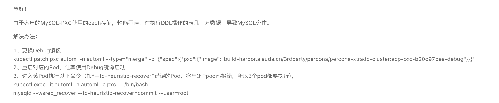

---
kind:
  - Troubleshooting
products:
  - Alauda Container Platform
  - Alauda DevOps
  - Alauda AI
  - Alauda Application Services
  - Alauda Service Mesh
  - Alauda Developer Portal
ProductsVersion:
  - 4.1.0,4.2.x
---
<!-- A type of document that involves encountering a fault, diagnosing it, performing root cause analysis, and providing solutions. -->

# mysql宕机

mysql宕机

## Cause

## Resolution

## [workaround]

## [Related Information]
**Screenshots**

- Environment: 3.10.1
- MySQL
- PXC
- MGR
- Component: MySQL/PXC
- Page ID: 333316744
- Original Title: 数据服务-数据服务-MySQL（PXC/MGR）-mysql宕机-115399
