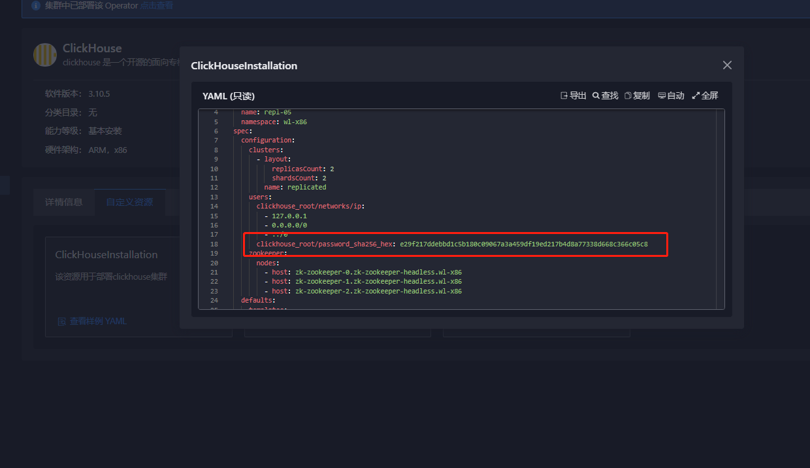

---
kind:
  - Troubleshooting
products:
  - Alauda Container Platform
  - Alauda DevOps
  - Alauda AI
  - Alauda Application Services
  - Alauda Service Mesh
  - Alauda Developer Portal
ProductsVersion:
  - 4.1.0,4.2.x
---
<!-- A type of document that involves encountering a fault, diagnosing it, performing root cause analysis, and providing solutions. -->

# clickhouse的初始密码如何查看

## 环境信息 适用版本：3.10.X

## Cause
- 初始密码采用sha256单项hash加密无法逆向破解

## Resolution
- 将配置中的sha256字符串替换为已知密码的sha256值

## [workaround]

## [Related Information]
**Screenshots**

- Environment: 3.10.X
- clickhouse_root_password
- clickhouse_root
- Component: clickhouse
- Page ID: 144902887
- Original Title: clickhouse的初始密码如何查看
