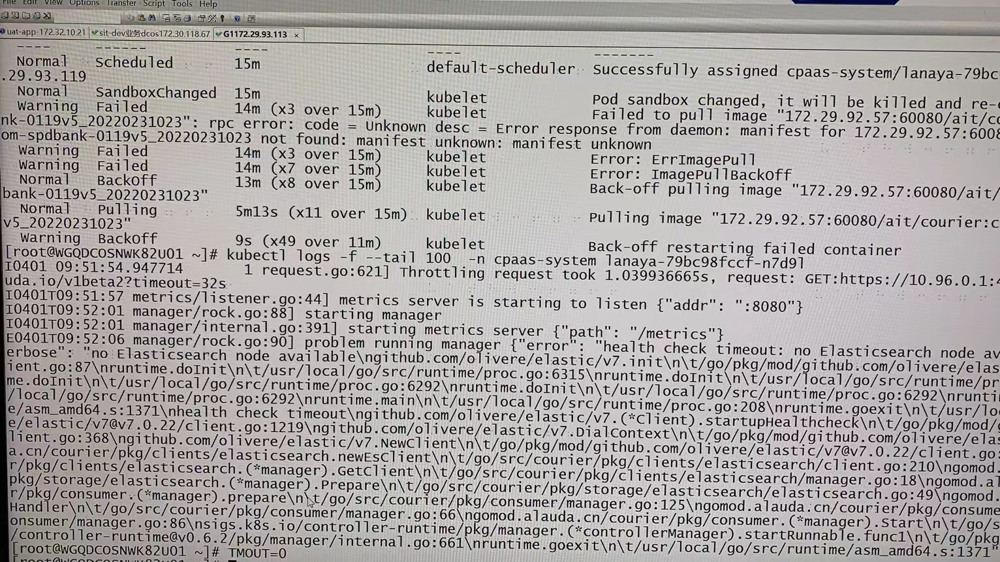

---
kind:
  - Troubleshooting
products:
  - Alauda Container Platform
  - Alauda DevOps
  - Alauda AI
  - Alauda Application Services
  - Alauda Service Mesh
  - Alauda Developer Portal
ProductsVersion:
  - 4.1.0,4.2.x
---
<!-- A type of document that involves encountering a fault, diagnosing it, performing root cause analysis, and providing solutions. -->

# 3.6.1

lanaya pod不断crash 无法连接es集群，返回401错误

## Cause
- 对接es用户权限不足，缺少创建/删除索引等必要权限

## Resolution
- 调整对接es用户权限

## [workaround]

## [Related Information]
**Screenshots**

- Environment: 3.6.1
- es
- kafka
- lanaya pod
- 用户权限配置
- Component: kafka
- Page ID: 112052819
- Original Title: 3.6.1-容器平台-可视化运维-对接外部es kafka按文档操作后lanaya pod不断crash
