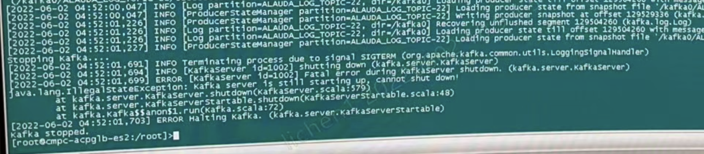

---
kind:
  - Troubleshooting
products:
  - Alauda Container Platform
  - Alauda DevOps
  - Alauda AI
  - Alauda Application Services
  - Alauda Service Mesh
  - Alauda Developer Portal
ProductsVersion:
  - 4.1.0,4.2.x
---
<!-- A type of document that involves encountering a fault, diagnosing it, performing root cause analysis, and providing solutions. -->

# 平台日志组件kafka异常无法正常启动

kafka容器0/1重启后无法正常启动 报错Terminating process due to singal SIGTERM /cpaas/data/kafka0目录堆积540G日志

## Cause
- 默认资源限制配置不足
- JVM配置过低(xmx1g/xms512m)
- 健康检查超时触发自动重启

## Resolution
- 调整部署组limits至4c8g
- 调整JVM参数为xmx6g/xms3g

## [workaround]

## [Related Information]
**Screenshots**

- Environment: 通用
- /cpaas/data/kafka0
- cpaas-kafka部署组
- xmx
- xms
- Component: kafka
- Page ID: 115528196
- Original Title: 平台日志组件kafka异常无法正常启动
