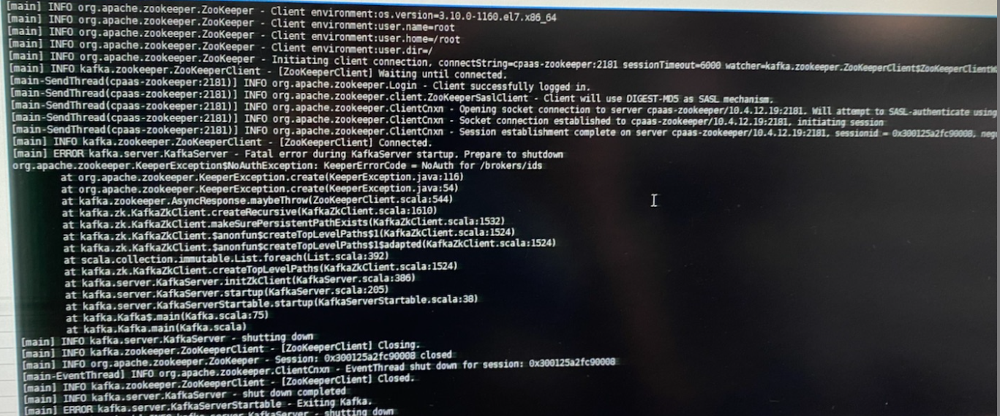
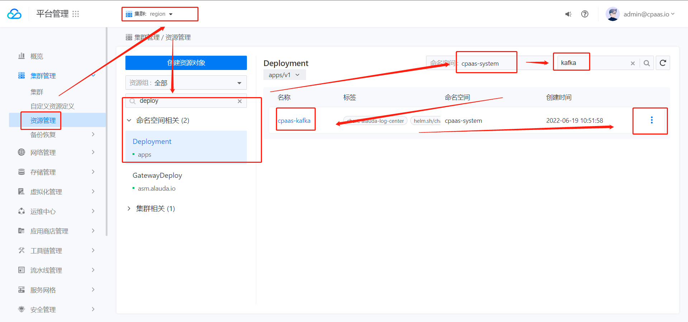
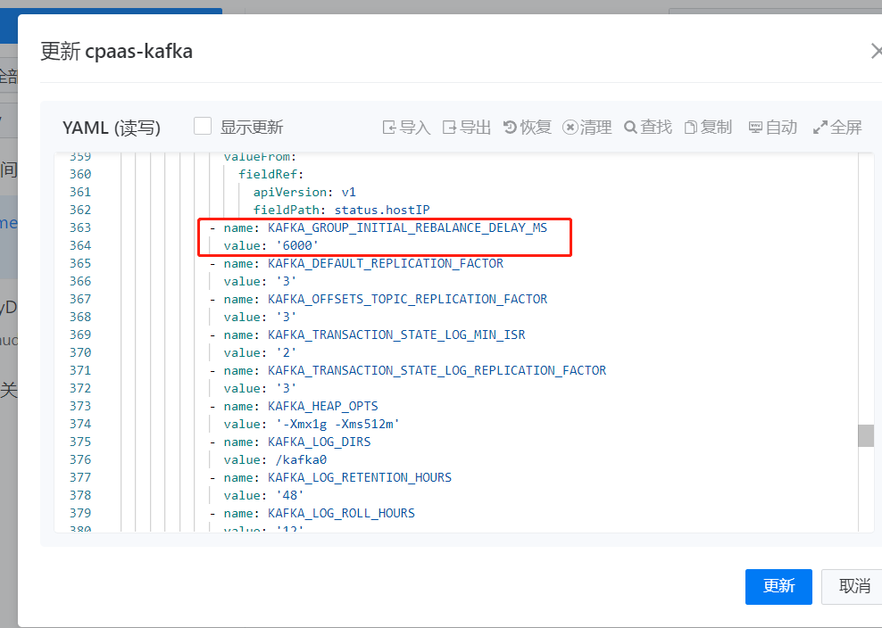

---
kind:
  - Troubleshooting
products:
  - Alauda Container Platform
  - Alauda DevOps
  - Alauda AI
  - Alauda Application Services
  - Alauda Service Mesh
  - Alauda Developer Portal
ProductsVersion:
  - 4.1.0,4.2.x
---
<!-- A type of document that involves encountering a fault, diagnosing it, performing root cause analysis, and providing solutions. -->

# 日志存储插件部署失败

kafka服务启动失败退出 kafka事件服务健康检查失败

## Cause
- 数据清理不彻底导致残留数据

## Resolution
- 卸载日志存储插件
- 删除数据目录：/cpaas/data/zookeeper, /cpaas/data/kafka*, /cpaas/data/elasticsearch
- 重新安装日志存储插件

## [workaround]

## [Related Information]
**Screenshots**

- Environment: 3.8.1
- zookeeper
- kafka
- elasticsearch
- /cpaas/data/
- Component: kafka
- Page ID: 115538568
- Original Title: 日志存储插件部署失败-kafka服务启动报错
