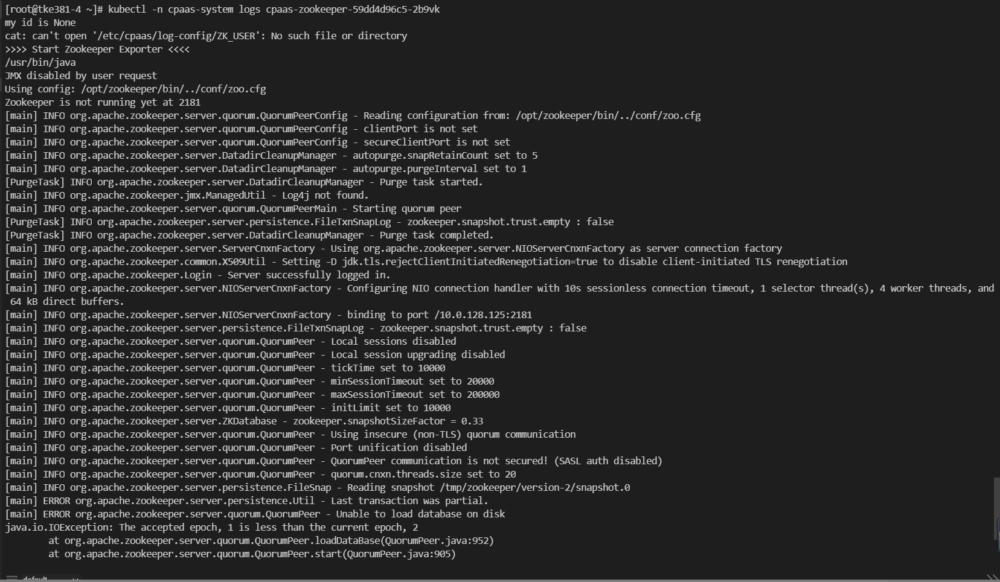

---
kind:
  - Troubleshooting
products:
  - Alauda Container Platform
  - Alauda DevOps
  - Alauda AI
  - Alauda Application Services
  - Alauda Service Mesh
  - Alauda Developer Portal
ProductsVersion:
  - 4.1.0,4.2.x
---
<!-- A type of document that involves encountering a fault, diagnosing it, performing root cause analysis, and providing solutions. -->

# 日志组件

cpaas-zookeeper组件启动失败 日志报错Unable to load database on disk

## Cause
- Zookeeper数据文件读取异常（version-2目录数据损坏或缺失）

## Resolution
- 在节点文件系统删除数据目录：rm -rf /cpaas/data/zookeeper/version-2
- 重启异常的cpaas-zookeeper服务Pod

## [workaround]

## [Related Information]
**Screenshots**

- Environment: 通用
- /cpaas/data/zookeeper
- version-2
- zookeeper
- Component: kafka
- Page ID: 119079103
- Original Title: 日志组件-cpaas-zookeeper组件启动失败-日志报错Unable to load database on disk；
