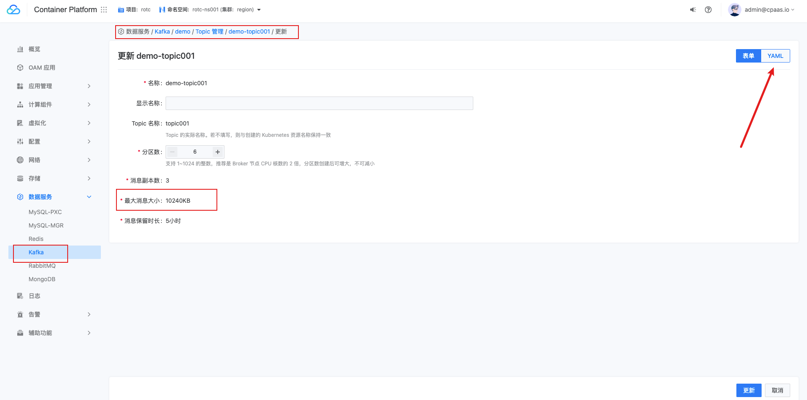
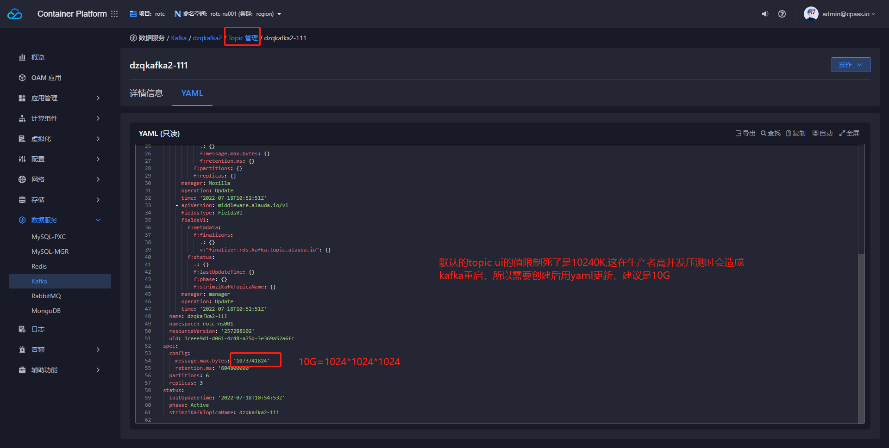

---
kind:
  - Troubleshooting
products:
  - Alauda Container Platform
  - Alauda DevOps
  - Alauda AI
  - Alauda Application Services
  - Alauda Service Mesh
  - Alauda Developer Portal
ProductsVersion:
  - 4.1.0,4.2.x
---
<!-- A type of document that involves encountering a fault, diagnosing it, performing root cause analysis, and providing solutions. -->

# kafka压测报错Map failed

kafka压测报错Map failed 日志提示分区数过大

## Cause
- segment.bytes参数配置不合理导致日志段数量过多

## Resolution
- 通过yaml方式调整segment.bytes参数配置

## [workaround]

## [Related Information]
**Screenshots**

- Environment: 3.8.1
- segment.bytes
- kafka分区数
- Component: kafka
- Page ID: 120107961
- Original Title: kafka压测报错Map failed
