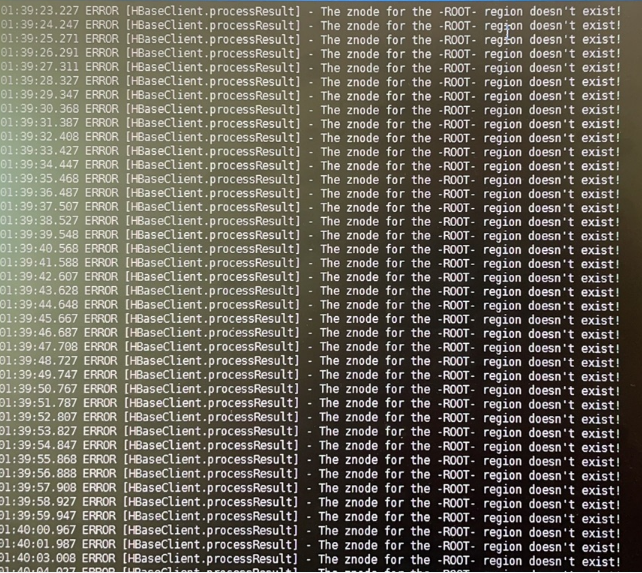

---
kind:
  - Troubleshooting
products:
  - Alauda Container Platform
  - Alauda DevOps
  - Alauda AI
  - Alauda Application Services
  - Alauda Service Mesh
  - Alauda Developer Portal
ProductsVersion:
  - 4.1.0,4.2.x
---
<!-- A type of document that involves encountering a fault, diagnosing it, performing root cause analysis, and providing solutions. -->

# alauda1.12opentsdb无法启动，日志报错The znode for the

opentsdb无法启动 日志报错The znode for the-root- region doesnt exist

## Cause
- HBase根region的znode在ZooKeeper中不存在
- HDFS数据异常导致region信息丢失

## Resolution
- 停掉hdfs,zk,hbase,opentsdb服务
- 清理hdfs目录/alauda/hdfs
- 清理zk/kafka/es目录
- 按顺序启动：zk -> hdfs-jn -> hdfs-nn1 -> hdfs-nn2 -> hbase -> opentsdb

## [workaround]

## [Related Information]
**Screenshots**

- Environment: alauda1.12
- hdfs
- zookeeper
- hbase
- opentsdb
- /alauda/hdfs
- kafka
- es
- Component: kafka
- Page ID: 120121901
- Original Title: alauda1.12opentsdb无法启动，日志报错The znode for the-root- region doesnt exist
