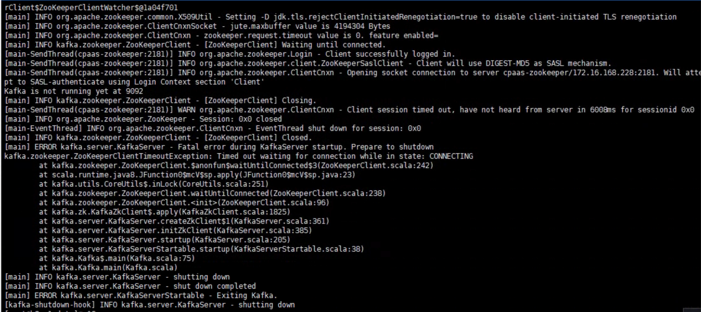

---
kind:
  - Troubleshooting
products:
  - Alauda Container Platform
  - Alauda DevOps
  - Alauda AI
  - Alauda Application Services
  - Alauda Service Mesh
  - Alauda Developer Portal
ProductsVersion:
  - 4.1.0,4.2.x
---
<!-- A type of document that involves encountering a fault, diagnosing it, performing root cause analysis, and providing solutions. -->

# kafka报错链接zk超时日志报错：kafka. zookeeper. Zookeepercllenttimeoutexception: Timed out waiting for connection while In state: CONNECTING

kafka.zookeeper.ZookeeperClientTimeoutException: Timed out waiting for connection while in state: CONNECTING

## Cause
- 存在DROP类型防火墙规则限制了Zookeeper服务端口

## Resolution
- 清理对应限制的防火墙规则

## [workaround]

## [Related Information]
**Screenshots**

- Environment: 通用
- Zookeeper端口
- iptables规则
- kafka服务配置
- zookeeper服务配置
- Component: kafka
- Page ID: 127421465
- Original Title: kafka报错链接zk超时日志报错：kafka. zookeeper. Zookeepercllenttimeoutexception: Timed out waiting for connection while In state: CONNECTING
