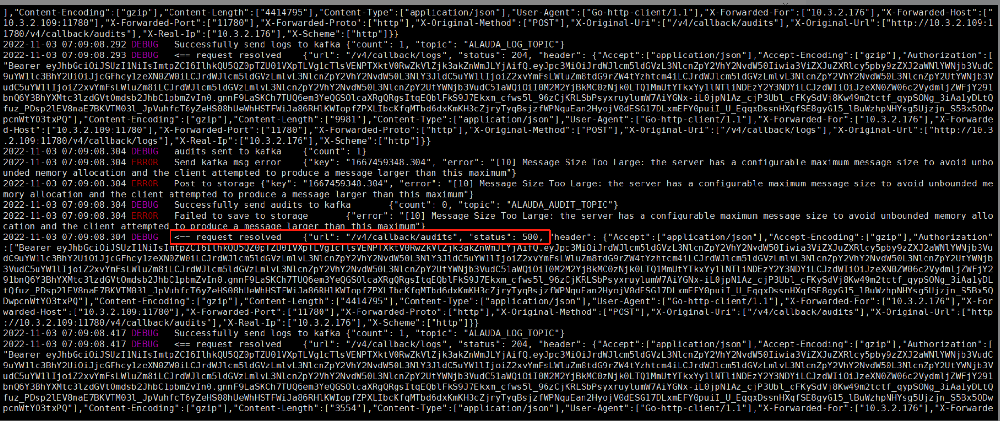

---
kind:
  - Troubleshooting
products:
  - Alauda Container Platform
  - Alauda DevOps
  - Alauda AI
  - Alauda Application Services
  - Alauda Service Mesh
  - Alauda Developer Portal
ProductsVersion:
  - 4.1.0,4.2.x
---
<!-- A type of document that involves encountering a fault, diagnosing it, performing root cause analysis, and providing solutions. -->

# 3.8.1

ES集群内无audit索引生成 razor返回状态码500

## Cause
- Kafka接收最大传输包大小限制1M导致数据无法上传

## Resolution
- 单独升级razor镜像到3.8.8版本
- 最终在3.8.2版本解决

## [workaround]

## [Related Information]
**Screenshots**

- Environment: 3.8.1
- kafka
- razor
- elasticsearch
- lanaya
- max.message.bytes
- Component: kafka
- Page ID: 130550573
- Original Title: 3.8.1-基础设施-业务集群单独部署日志存储-审计无数据
