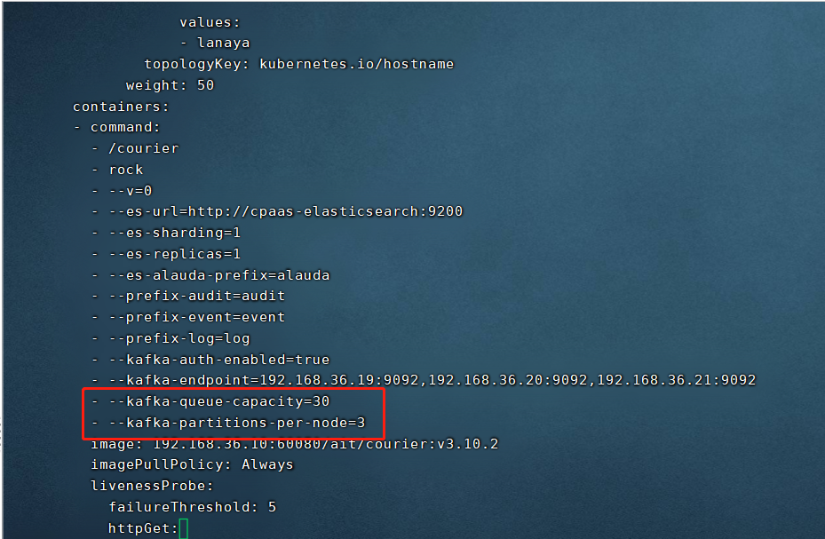

---
kind:
  - Troubleshooting
products:
  - Alauda Container Platform
  - Alauda DevOps
  - Alauda AI
  - Alauda Application Services
  - Alauda Service Mesh
  - Alauda Developer Portal
ProductsVersion:
  - 4.1.0,4.2.x
---
<!-- A type of document that involves encountering a fault, diagnosing it, performing root cause analysis, and providing solutions. -->

# 3.10

JIRA Jira：

## Cause

## Resolution
- lanaya组件频繁OOM重启
- 1、临时调整lanaya组件内存配置：默认为2c4g更改为2c8g后仍存在oom行为；
- ## 解决方案
- kubectl edit deploy -ncpaas-system lanaya

## [workaround]

## [Related Information]
**Screenshots**

- 10
- 30
- 11
- 58
- 16
- /3-10-ji-chu-she-shi-lanayazu-jian-pin-fan-oomzhong-qi/image2022-11-6_10-58-16.png
- node
- Component: kafka
- Page ID: 130550581
- Original Title: 3.10-基础设施-lanaya组件频繁OOM重启
