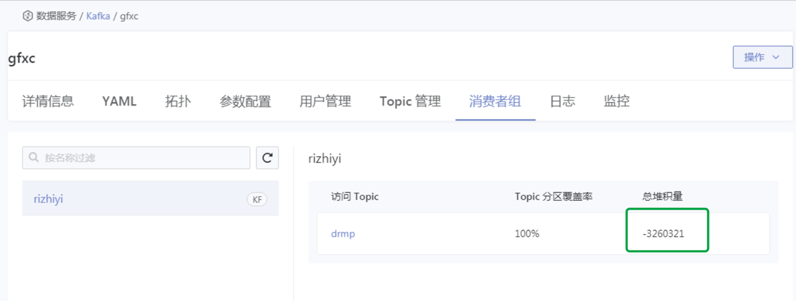

---
kind:
  - Troubleshooting
products:
  - Alauda Container Platform
  - Alauda DevOps
  - Alauda AI
  - Alauda Application Services
  - Alauda Service Mesh
  - Alauda Developer Portal
ProductsVersion:
  - 4.1.0,4.2.x
---
<!-- A type of document that involves encountering a fault, diagnosing it, performing root cause analysis, and providing solutions. -->

# kafka消费者堆积数为负数

消费者堆积数为负数

## Cause
- 消费者处理速度超过生产者速度，供小于求

## Resolution
- 属于正常现象，无需处理

## [workaround]

## [Related Information]
**Screenshots**

- Environment: 3.6, 3.8, 3.10
- kafka consumer lag
- Component: kafka
- Page ID: 130576421
- Original Title: kafka消费者堆积数为负数
