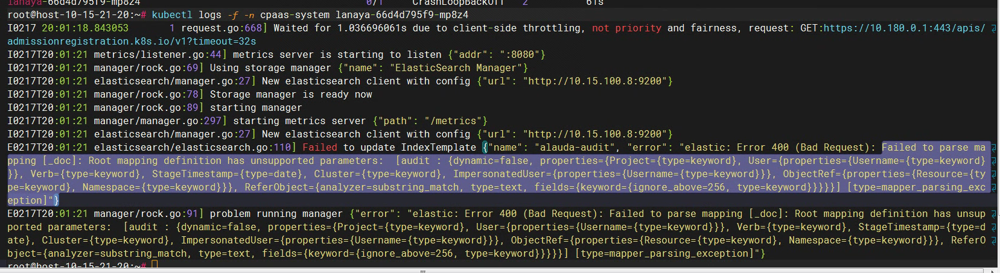

---
kind:
  - Troubleshooting
products:
  - Alauda Container Platform
  - Alauda DevOps
  - Alauda AI
  - Alauda Application Services
  - Alauda Service Mesh
  - Alauda Developer Portal
ProductsVersion:
  - 4.1.0,4.2.x
---
<!-- A type of document that involves encountering a fault, diagnosing it, performing root cause analysis, and providing solutions. -->

# 3.8.2

业务集群部署日志存储插件（对接外部es）失败 lanaya组件运行异常 lanaya组件日志报错“Failed to parse mapping [_doc]”

## Cause
- 外部es版本为7.X，与当前平台版本3.10不兼容

## Resolution
- 将外部es版本更换为6.8.13

## [workaround]

## [Related Information]
**Screenshots**

- Environment: 3.10
- lanaya组件
- 外部es
- mapping [_doc]
- Component: kafka
- Page ID: 140824800
- Original Title: 3.8.2-基础架构-业务集群部署日志存储插件（外部es）异常）
