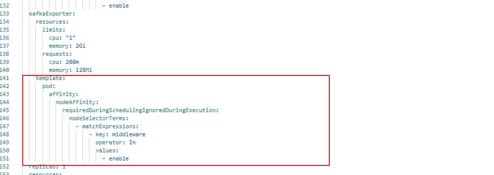
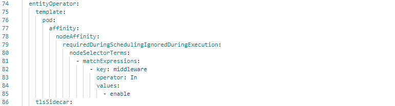

---
kind:
  - Troubleshooting
products:
  - Alauda Container Platform
  - Alauda DevOps
  - Alauda AI
  - Alauda Application Services
  - Alauda Service Mesh
  - Alauda Developer Portal
ProductsVersion:
  - 4.1.0,4.2.x
---
<!-- A type of document that involves encountering a fault, diagnosing it, performing root cause analysis, and providing solutions. -->

# 3.8.2

kafka-cluster-entity-operator、kafka-cluster-kafka-exporter pod未绑定指定节点

## Cause
- 未配置节点亲和性规则

## Resolution
- 在entityoperator和kafkaexporter配置段添加nodeAffinity配置:
entityOperator:
  template:
    pod:
      affinity:
        nodeAffinity:
kafkaExporter:
  template:
    pod:
      affinity:
        nodeAffinity:

## [workaround]

## [Related Information]
**Screenshots**

- Environment: v3.8.2 kafka
- entityOperator.template.pod.affinity.nodeAffinity
- kafkaExporter.template.pod.affinity.nodeAffinity
- 节点标签
- Component: kafka
- Page ID: 140825018
- Original Title: 3.8.2-数据服务-kafka组件节点绑定
