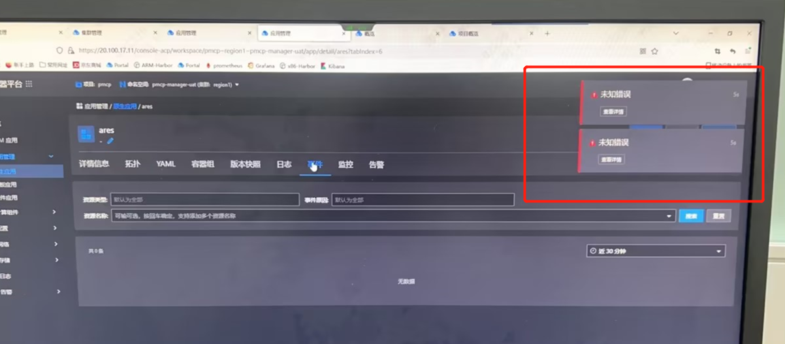
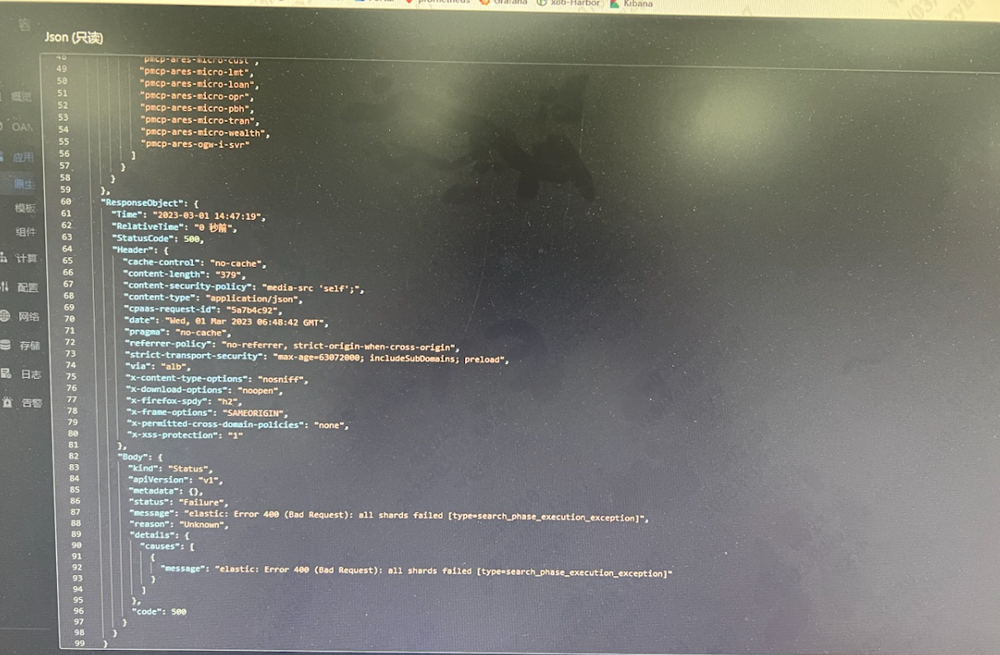

---
kind:
  - Troubleshooting
products:
  - Alauda Container Platform
  - Alauda DevOps
  - Alauda AI
  - Alauda Application Services
  - Alauda Service Mesh
  - Alauda Developer Portal
ProductsVersion:
  - 4.1.0,4.2.x
---
<!-- A type of document that involves encountering a fault, diagnosing it, performing root cause analysis, and providing solutions. -->

# 应用界面查看事件报内部错误

应用管理界面查看事件报内部错误 错误信息: elastic: Error 400 (Bad Request): all shards failed [typessearch_phase_execution_exception] 跨多个命名空间复现

## Cause
- Elasticsearch索引及索引模板被误删除

## Resolution
- 清理Elasticsearch和Kafka数据重建索引

## [workaround]

## [Related Information]
**Screenshots**

- Environment: 3.8/3.10版本容器平台
- elasticsearch索引
- 索引模板
- kafka数据
- Component: kafka
- Page ID: 140825025
- Original Title: 容器平台-应用界面查看事件报内部错误
