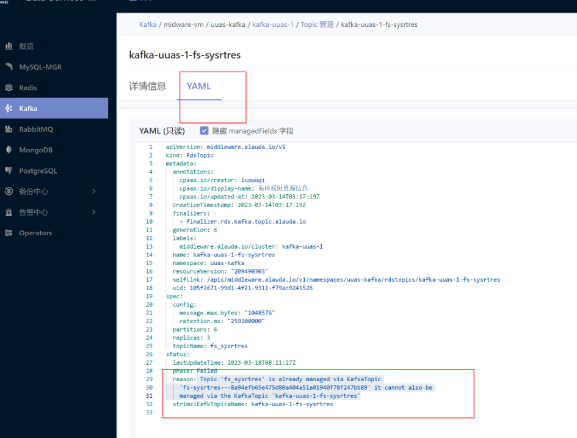

---
kind:
  - Troubleshooting
products:
  - Alauda Container Platform
  - Alauda DevOps
  - Alauda AI
  - Alauda Application Services
  - Alauda Service Mesh
  - Alauda Developer Portal
ProductsVersion:
  - 4.1.0,4.2.x
---
<!-- A type of document that involves encountering a fault, diagnosing it, performing root cause analysis, and providing solutions. -->

# kafka topic创建失败

Topic 'fs_sysrtres' is already managed via KafkaTopic 'fs-sysrtres---8a94efb65e475d80a404a51a01940f78f247bb89' it cannot also be managed via the KafkaTopic 'kafka-uuas-1-fs-sysrtres'

## Cause
- 存在同名 KafkaTopic 资源 'fs-sysrtres---8a94efb65e475d80a404a51a01940f78f247bb89' 未被删除

## Resolution
- 执行命令 `kubectl delete kafkatopic -n xxx fs-sysrtres---8a94efb65e475d80a404a51a01940f78f247bb89` 删除冲突资源

## [workaround]

## [Related Information]
**Screenshots**

- Environment: 3.8, 3.10-cce
- kubectl get kafkatopic
- kubectl get rdstopics
- KafkaTopic
- RdsTopics
- Component: kafka
- Page ID: 140825065
- Original Title: 数据服务-kafka topic创建失败
