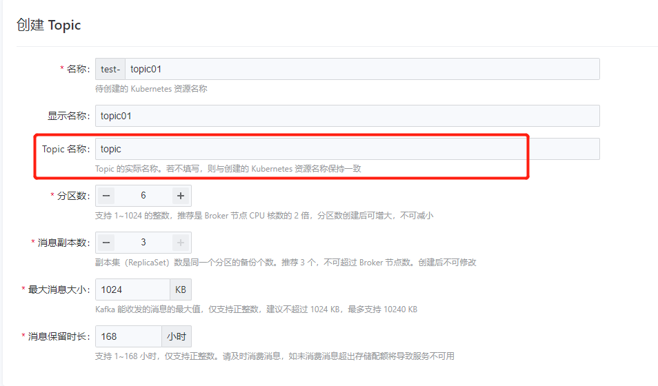
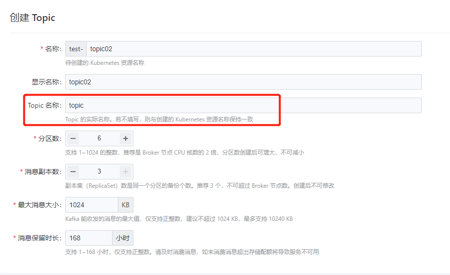
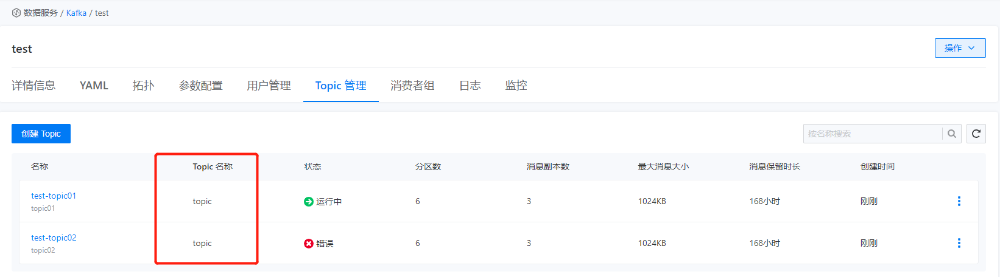
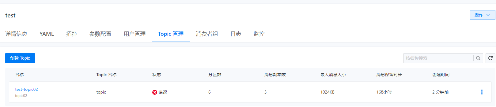
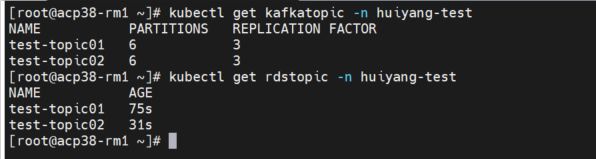
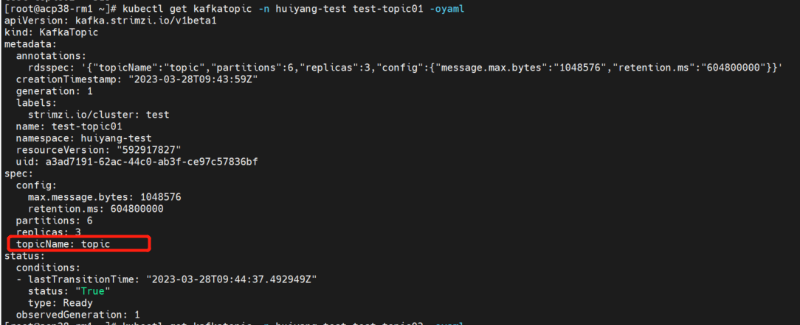
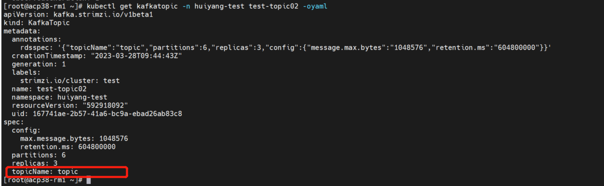

---
kind:
  - Troubleshooting
products:
  - Alauda Container Platform
  - Alauda DevOps
  - Alauda AI
  - Alauda Application Services
  - Alauda Service Mesh
  - Alauda Developer Portal
ProductsVersion:
  - 4.1.0,4.2.x
---
<!-- A type of document that involves encountering a fault, diagnosing it, performing root cause analysis, and providing solutions. -->

# 如何判断kafka的topic name重复

'topic' is already managed via KafkaTopic 'test-topic01' it cannot also be managed via the KafkaTopic 'test-topic02'

## Cause
- 存在两个同名但不同CRD资源名称的KafkaTopic资源

## Resolution
- 通过kubectl delete kafkatopic -n删除重复的KafkaTopic资源

## [workaround]

## [Related Information]
**Screenshots**

- Environment: 3.8,3.10
- kubectl get kafkatopic
- kubectl get rdstopic
- -n
- KafkaTopic CRD
- RdsTopic CRD
- Component: kafka
- Page ID: 140825090
- Original Title: 数据服务-如何判断kafka的topic name重复
