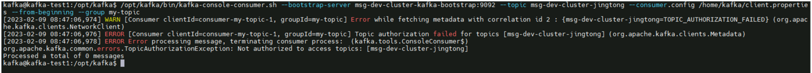
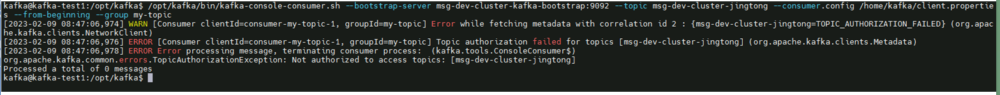
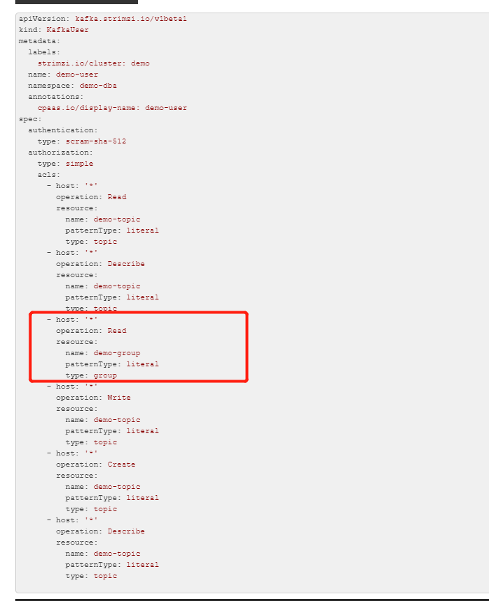

---
kind:
  - Troubleshooting
products:
  - Alauda Container Platform
  - Alauda DevOps
  - Alauda AI
  - Alauda Application Services
  - Alauda Service Mesh
  - Alauda Developer Portal
ProductsVersion:
  - 4.1.0,4.2.x
---
<!-- A type of document that involves encountering a fault, diagnosing it, performing root cause analysis, and providing solutions. -->

# 使用生产者消费者连接kafka失败

使用生产者消费者连接kafka失败

## Cause
- 创建kafkauser时authorization.type=group的name字段未配置正确值

## Resolution
- 修改KafkaUser资源的authorization配置，将group类型的name字段改为正确的值

## [workaround]

## [Related Information]
**Screenshots**

- Environment: 3.6
- kafkauser
- authorization.type
- group.name
- Component: kafka
- Page ID: 140827118
- Original Title: 数据服务-使用生产者消费者连接kafka失败
