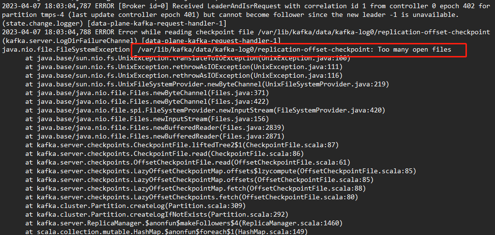

---
kind:
  - Troubleshooting
products:
  - Alauda Container Platform
  - Alauda DevOps
  - Alauda AI
  - Alauda Application Services
  - Alauda Service Mesh
  - Alauda Developer Portal
ProductsVersion:
  - 4.1.0,4.2.x
---
<!-- A type of document that involves encountering a fault, diagnosing it, performing root cause analysis, and providing solutions. -->

# 3.8.1

kafka实例日志报错部分文件内容因打开的文件太多导致无法加载 最大打开文档数量达到上限

## Cause
- segment.bytes参数设置为1048576k(1M)过小，频繁生成segment文件导致连接数耗尽

## Resolution
- 清理当前topic后重新创建，设置segment.bytes参数为100M

## [workaround]

## [Related Information]
**Screenshots**
segment.bytes

- Environment: 3.8.1-cce
- segment.bytes
- message.max.bytes
- topic
- Component: kafka
- Page ID: 144903655
- Original Title: 3.8.1-cce-中间件-kafka实例异常-参数设置不合规导致
