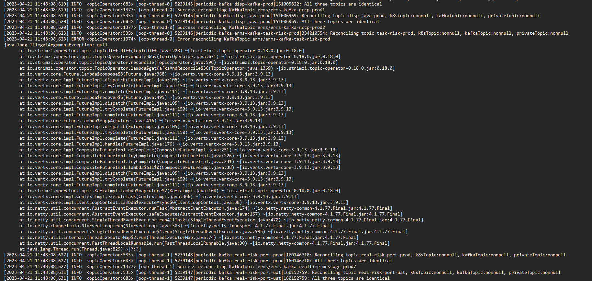

---
kind:
  - Troubleshooting
products:
  - Alauda Container Platform
  - Alauda DevOps
  - Alauda AI
  - Alauda Application Services
  - Alauda Service Mesh
  - Alauda Developer Portal
ProductsVersion:
  - 4.1.0,4.2.x
---
<!-- A type of document that involves encountering a fault, diagnosing it, performing root cause analysis, and providing solutions. -->

# 3.8.1

创建rdstopic时未指定topicName，删除后重建失败 新建其他topic一直处于创建中 kafka-operator日志报错

## Cause
- 删除操作未正确清理broker中的topic残留
- topic-operator状态未同步导致创建冲突

## Resolution
- 删除创建失败的rdstopic资源
- 检查broker中是否残留同名topic（bin/kafka-topics.sh --bootstrap-server 127.0.0.1:9092 --list）
- 观察topic-operator日志恢复情况
- 确认broker无残留后重新创建rdstopic

## [workaround]

## [Related Information]
**Screenshots**

- Environment: 3.8.1 3.8.1-cce
- kafka-topics.sh
- kafkatopic
- rdstopic
- topic-operator
- Component: kafka
- Page ID: 146354534
- Original Title: 3.8.1-Kafka-topic创建失败
