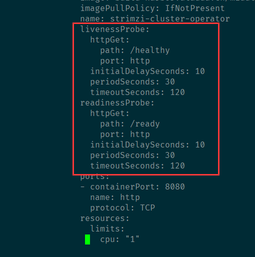
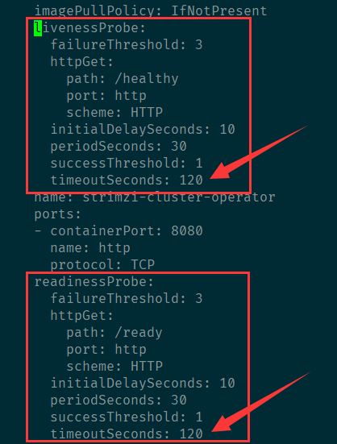

---
kind:
  - Troubleshooting
products:
  - Alauda Container Platform
  - Alauda DevOps
  - Alauda AI
  - Alauda Application Services
  - Alauda Service Mesh
  - Alauda Developer Portal
ProductsVersion:
  - 4.1.0,4.2.x
---
<!-- A type of document that involves encountering a fault, diagnosing it, performing root cause analysis, and providing solutions. -->

# Kafka Operator 修改探针超时时间

探针超时时间不足导致存活/就绪检查失败

## Cause
- 默认探针配置timeoutSeconds参数值过小

## Resolution
- 通过kubectl edit csv修改strimzi-kafka-operator的CSV配置
- 调整spec.install.spec.deployments.spec.template.spec.containers.livenessProbe.timeoutSeconds和readinessProbe.timeoutSeconds
- 等待CSV进入Succeeded状态
- 验证Operator Pod的探针配置是否生效

## [workaround]

## [Related Information]
**Screenshots**

- Environment: strimzi-kafka-operator 3.8/3.10/3.12版本
- strimzi-kafka-operator
- CSV
- Deployment
- http端口
- /healthy路径
- /ready路径
- timeoutSeconds配置键
- initialDelaySeconds配置键
- periodSeconds配置键
- Component: kafka
- Page ID: 149607355
- Original Title: Kafka Operator 修改探针超时时间
