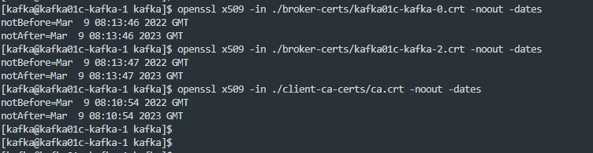
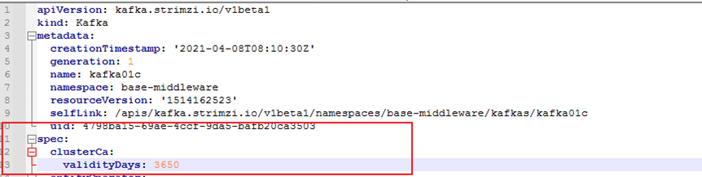

---
kind:
  - Troubleshooting
products:
  - Alauda Container Platform
  - Alauda DevOps
  - Alauda AI
  - Alauda Application Services
  - Alauda Service Mesh
  - Alauda Developer Portal
ProductsVersion:
  - 4.1.0,4.2.x
---
<!-- A type of document that involves encountering a fault, diagnosing it, performing root cause analysis, and providing solutions. -->

# 3.4.2

应用无法推送数据到kafka的topic中 kafka节点报错CertificateExpiredException: NotAfter: Thu Mar 09 08:13:47 UTC 2023

## Cause
- kafka相关证书过期

## Resolution
- 修改kafka的yaml添加clusterCa: validityDays: 3650
- 执行强制证书更新命令: kubectl annotate secret -n 命名空间 kafka实例名称-cluster-ca-cert strimzi.io/force-renew=true
- 删除operator对应的pod触发组件更新

## [workaround]

## [Related Information]
**Screenshots**

- Environment: 3.4.2
- clusterCa
- validityDays
- kafka实例名称-cluster-ca-cert
- strimzi.io/force-renew
- kafka
- zk
- operator-pod
- Component: kafka
- Page ID: 152633557
- Original Title: 3.4.2-数据服务-kafka证书过期导致kafka服务异常
