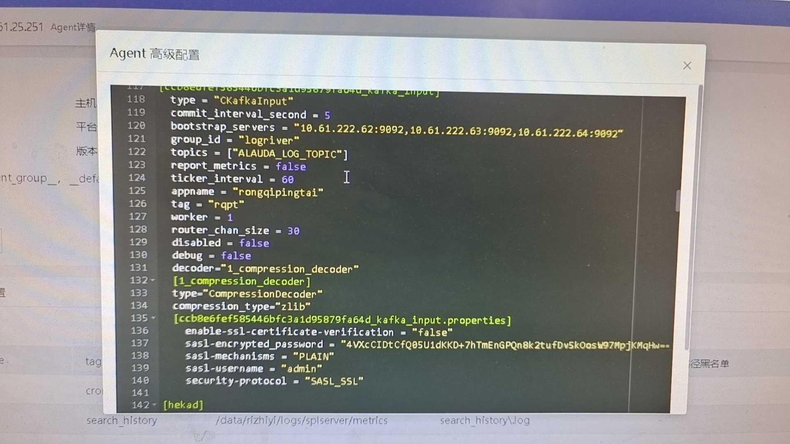
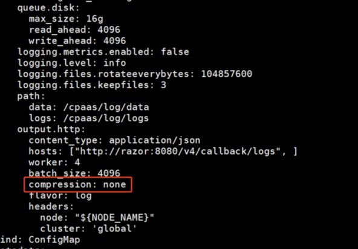
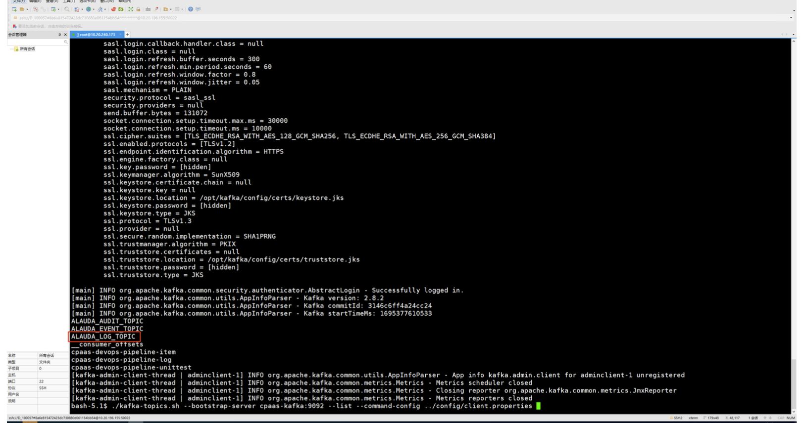
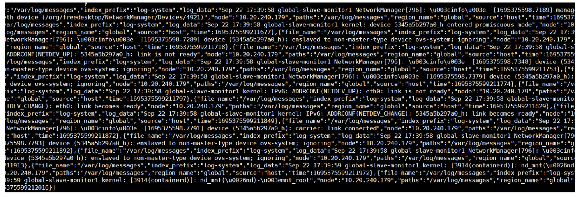

---
kind:
  - Troubleshooting
products:
  - Alauda Container Platform
  - Alauda DevOps
  - Alauda AI
  - Alauda Application Services
  - Alauda Service Mesh
  - Alauda Developer Portal
ProductsVersion:
  - 4.1.0,4.2.x
---
<!-- A type of document that involves encountering a fault, diagnosing it, performing root cause analysis, and providing solutions. -->

# 如何查看Kafka topic数据

查看topic数据会乱码 日志易显示时日志中的[ ]被过滤掉

## Cause
- compression_type=zlib导致数据压缩
- 日志易消费时过滤了特定字符

## Resolution
- 修改nevermore的configmap将compression_type改为none
- kubectl edit cm -n cpaas-system nevermore-config
- 在kafka容器内配置client.properties安全参数
- 执行./kafka-topics.sh --bootstrap-server cpaas-kafka:9092 --list --command-config ../config/client.properties
- 执行./kafka-console-consumer.sh --bootstrap-server cpaas-kafka:9092 --topic ALAUDA_*TOPIC --consumer.config ../config/client.properties

## [workaround]

## [Related Information]
**Screenshots**

- Environment: 3.12.2
- cpaas-system
- client.properties
- security.protocol=sasl_ssl
- sasl.mechanism=PLAIN
- kafka-topics.sh
- kafka-console-consumer.sh
- ALAUDA_LOG_TOPIC
- Component: kafka
- Page ID: 163081930
- Original Title: 如何查看Kafka topic数据-[外部日志易对接平台kafka]
