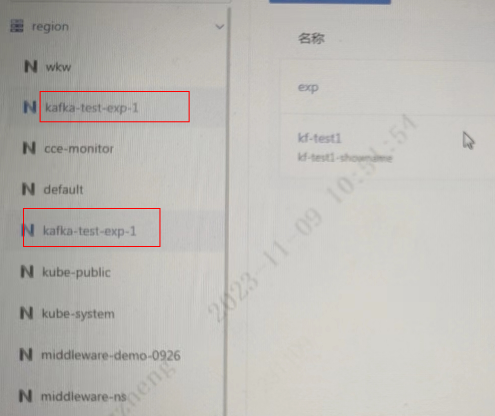

---
kind:
  - Troubleshooting
products:
  - Alauda Container Platform
  - Alauda DevOps
  - Alauda AI
  - Alauda Application Services
  - Alauda Service Mesh
  - Alauda Developer Portal
ProductsVersion:
  - 4.1.0,4.2.x
---
<!-- A type of document that involves encountering a fault, diagnosing it, performing root cause analysis, and providing solutions. -->

# 数据服务kafka页面，region集群下显示两个同名命名空间

region集群下显示两个同名命名空间

## Cause
- 同时设置项目管理员权限和命名空间权限触发版本bug

## Resolution
- 升级到3.12.1或后续版本

## [workaround]

## [Related Information]
**Screenshots**

- Environment: 3.10.3-cce.3
- 项目管理员权限
- 命名空间权限
- Data Services视图
- Component: kafka
- Page ID: 168327436
- Original Title: 数据服务kafka页面，region集群下显示两个同名命名空间
