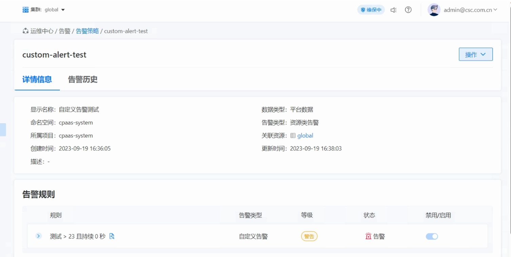

---
kind:
  - Troubleshooting
products:
  - Alauda Container Platform
  - Alauda DevOps
  - Alauda AI
  - Alauda Application Services
  - Alauda Service Mesh
  - Alauda Developer Portal
ProductsVersion:
  - 4.1.0,4.2.x
---
<!-- A type of document that involves encountering a fault, diagnosing it, performing root cause analysis, and providing solutions. -->

# 3.12.1

自定义告警触发后告警历史页面无记录 告警发送成功且Kafka无数据堆积

## Cause
- 告警历史读取时索引前缀在代码中硬编码为event-*
- 客户ES索引前缀被修改为tke-event-*导致查询失败

## Resolution
- 修复代码中硬编码的索引前缀
- 使用配置中的tke-event-*前缀进行ES查询

## [workaround]

## [Related Information]
**Screenshots**

- Environment: 3.12.1
- event-*
- tke-event-*
- ElasticSearch
- Courier组件
- Apollo告警历史API
- Global对接配置
- Component: kafka
- Page ID: 178228899
- Original Title: 3.12.1-容器平台-自定义告警触发后，告警历史页面显示无告警历史
