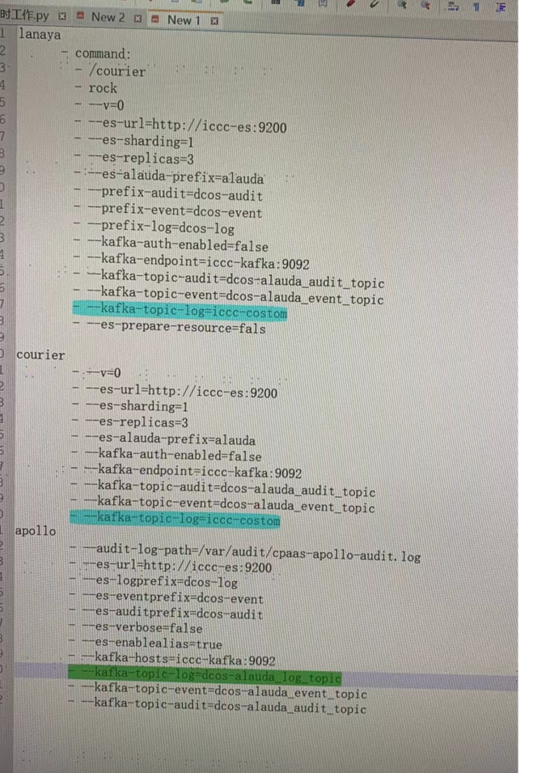
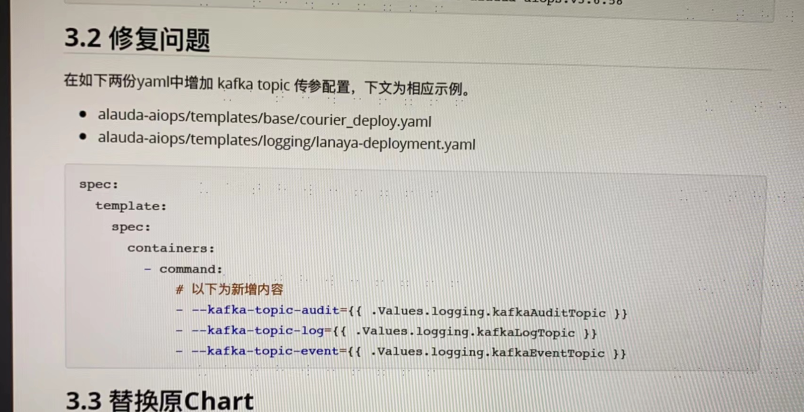
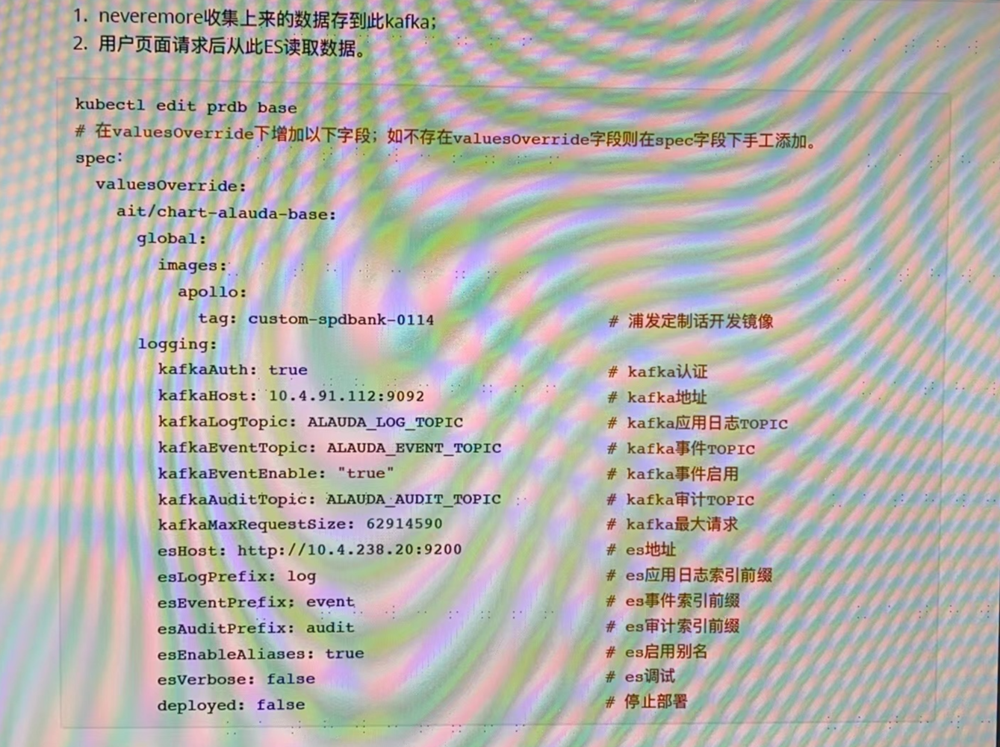

---
kind:
  - Troubleshooting
products:
  - Alauda Container Platform
  - Alauda DevOps
  - Alauda AI
  - Alauda Application Services
  - Alauda Service Mesh
  - Alauda Developer Portal
ProductsVersion:
  - 4.1.0,4.2.x
---
<!-- A type of document that involves encountering a fault, diagnosing it, performing root cause analysis, and providing solutions. -->

# 3.6.1

apollo、lanaya、courier配置中的--kafka-topic-log参数填写不一致 外部ES中存在logstash-other-2023.10.16索引

## Cause
- lanaya组件配置的kafka-topic-log参数错误
- 存在第三方进程消费kafka数据写入ES

## Resolution
- 检查并修正lanaya组件的kafka-topic-log配置
- 排查是否存在第三方消费进程

## [workaround]

## [Related Information]
**Screenshots**

- Environment: 3.6.1
- apollo
- lanaya
- courier
- --kafka-topic-log
- logstash-other-2023.10.16
- Component: kafka
- Page ID: 179603510
- Original Title: 3.6.1-咨询-运维中心-关于对接外部kafka的topic答疑
