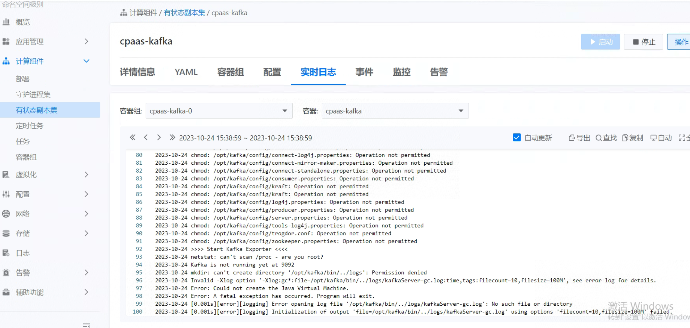

---
kind:
  - Troubleshooting
products:
  - Alauda Container Platform
  - Alauda DevOps
  - Alauda AI
  - Alauda Application Services
  - Alauda Service Mesh
  - Alauda Developer Portal
ProductsVersion:
  - 4.1.0,4.2.x
---
<!-- A type of document that involves encountering a fault, diagnosing it, performing root cause analysis, and providing solutions. -->

# 3.12.1

日志存储插件未完成部署 kafka组件异常 kafka日志无报错

## Cause
- kafka相关镜像存在问题或残留

## Resolution
- 删除节点上的kafka相关镜像
- 重启kafka组件

## [workaround]

## [Related Information]
**Screenshots**

- kafka
- Component: kafka
- Page ID: 179604082
- Original Title: 3.12.1-基础架构-部署日志存储插件状态异常
