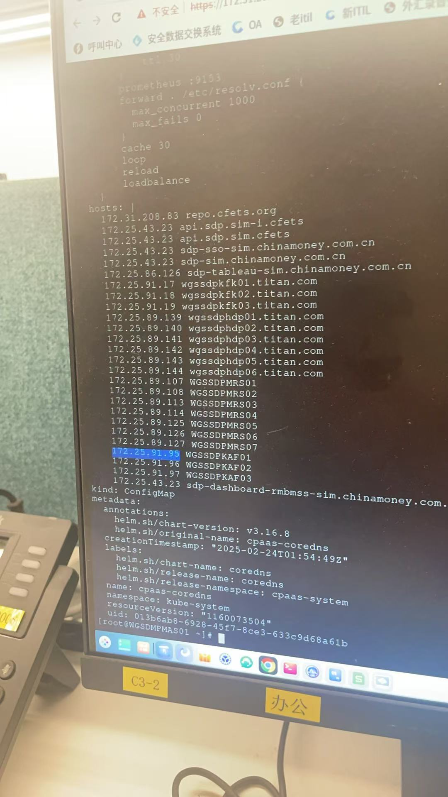

---
kind:
  - Troubleshooting
products:
  - Alauda Container Platform
  - Alauda DevOps
  - Alauda AI
  - Alauda Application Services
  - Alauda Service Mesh
  - Alauda Developer Portal
ProductsVersion:
  - 4.1.0,4.2.x
---
<!-- A type of document that involves encountering a fault, diagnosing it, performing root cause analysis, and providing solutions. -->

# kafka 应用启动时卡顿几秒

kafka应用启动时卡顿几秒 Pod中有反向解析DNS请求，每次请求2秒后返回错误

## Cause
- 生产集群coredns ConfigMap缺少hosts配置导致DNS查询失败

## Resolution
- 在Pod中添加hosts配置临时解决
- 修改coredns ConfigMap添加hosts配置后删除Pod的hosts配置

## [workaround]
- 在Pod spec中配置hosts记录

## [Related Information]
**Screenshots**

- coredns ConfigMap
- /etc/resolv.conf
- Pod hosts配置
- Component: kafka
- Page ID: 279576740
- Original Title: kafka 应用启动时卡顿几秒
