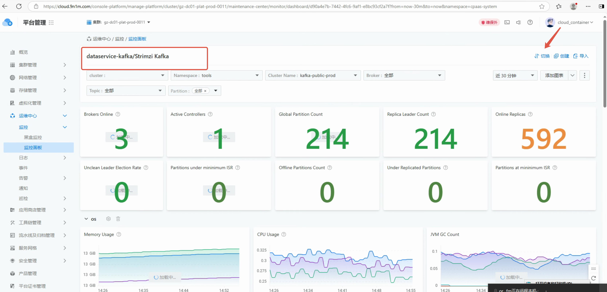
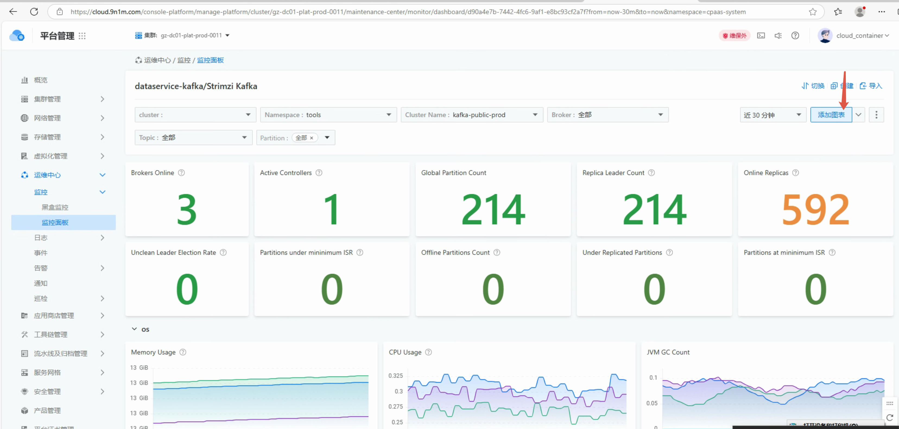
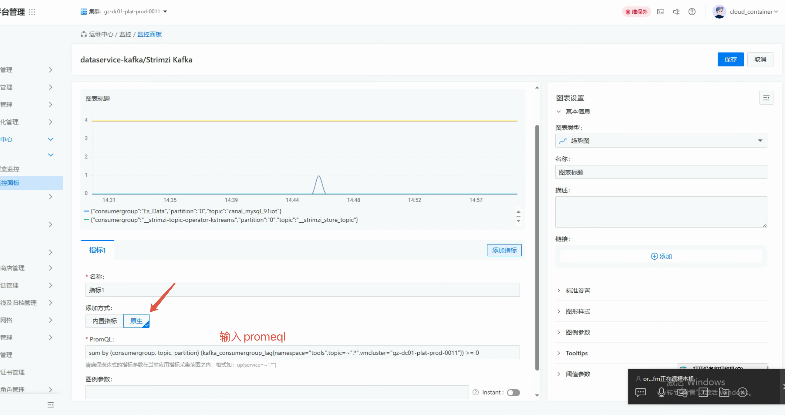
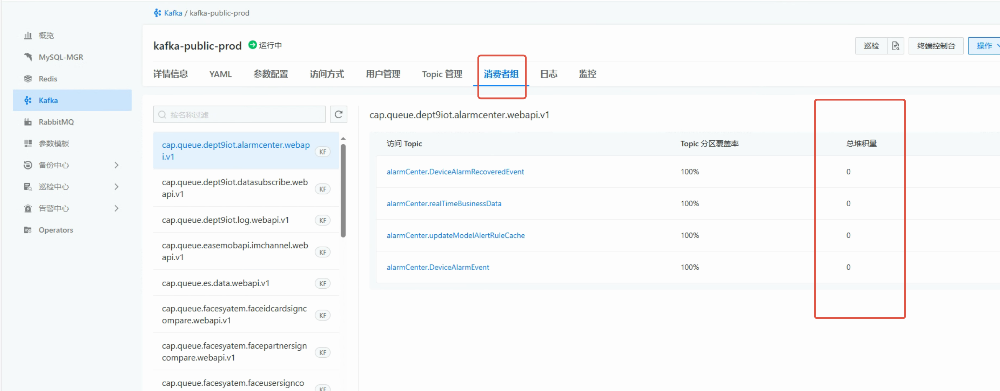
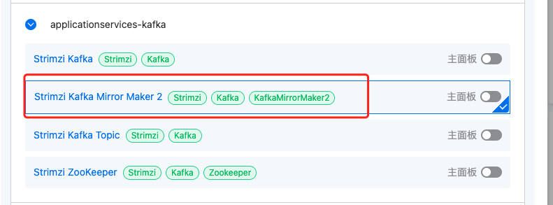
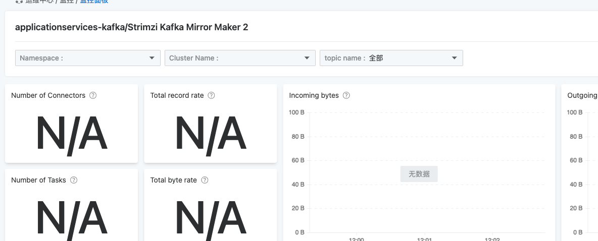
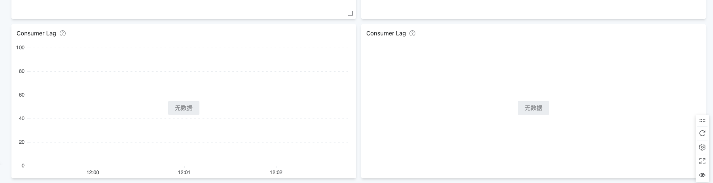
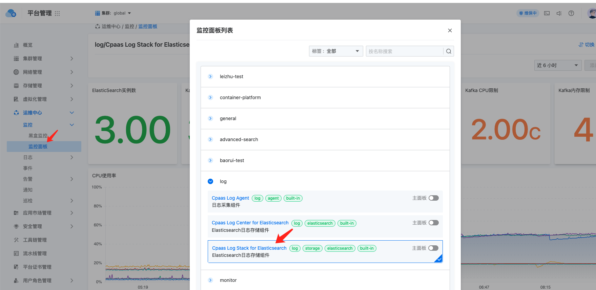
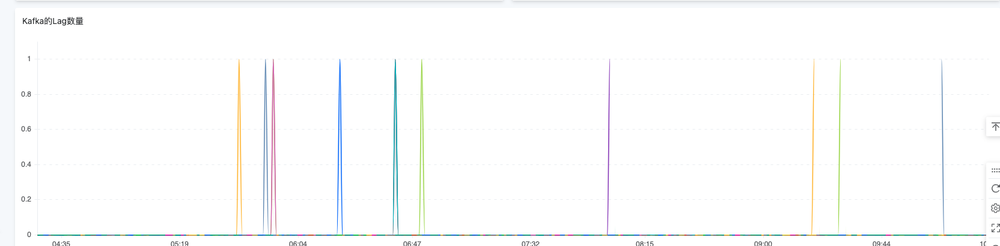
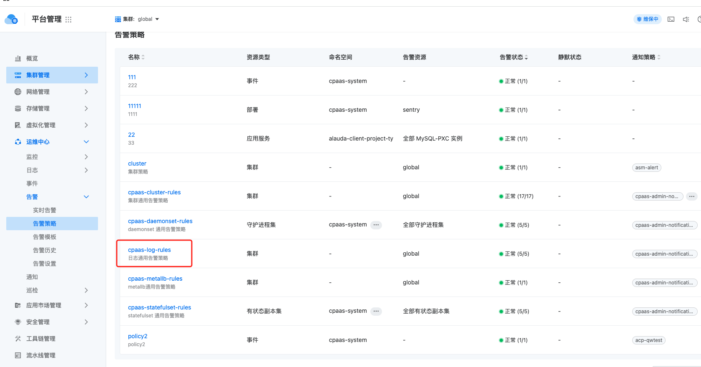

---
kind:
  - Troubleshooting
products:
  - Alauda Container Platform
  - Alauda DevOps
  - Alauda AI
  - Alauda Application Services
  - Alauda Service Mesh
  - Alauda Developer Portal
ProductsVersion:
  - 4.1.0,4.2.x
---
<!-- A type of document that involves encountering a fault, diagnosing it, performing root cause analysis, and providing solutions. -->

# 基础架构,运维中心,日志事件审计

无法在自带监控面板查看所有消费组的整体积压情况 需要将Kafka监控数据对接现有告警平台实现堆积阈值告警

## Cause
- Kafka默认监控功能不支持多消费组积压聚合展示
- 原生监控系统缺乏与外部告警平台的直接集成能力

## Resolution
- 使用Kafka exporter/JMX exporter收集数据并导入Prometheus
- 在Grafana创建自定义仪表盘展示kafka_consumer_lag指标
- 配置Prometheus告警规则基于kafka_consumer_lag阈值触发告警
- 通过Alertmanager路由告警到现有平台

## [workaround]

## [Related Information]
**Screenshots**

- Environment: v3.18.1
- Kafka exporter
- JMX exporter
- Prometheus
- Grafana
- Alertmanager
- kafka_consumer_lag
- Component: kafka
- Page ID: 289112151
- Original Title: 基础架构,运维中心,日志事件审计-容器kafka使用问题-106987-zh
