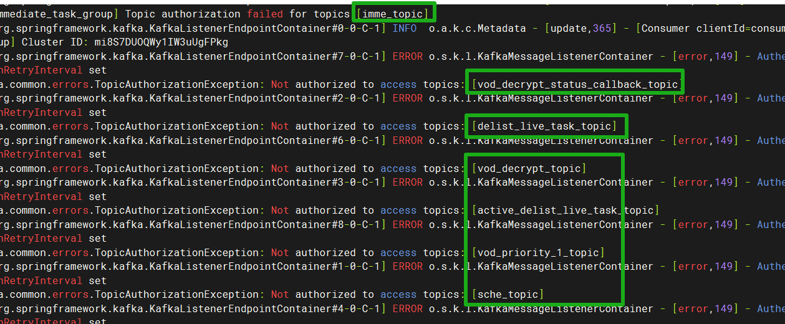
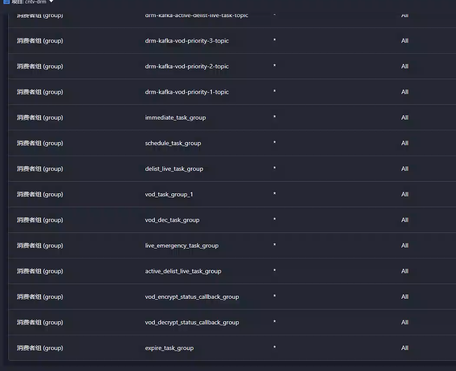

---
kind:
  - Troubleshooting
products:
  - Alauda Container Platform
  - Alauda DevOps
  - Alauda AI
  - Alauda Application Services
  - Alauda Service Mesh
  - Alauda Developer Portal
ProductsVersion:
  - 4.1.0,4.2.x
---
<!-- A type of document that involves encountering a fault, diagnosing it, performing root cause analysis, and providing solutions. -->

# kafka咨询

kafka消费失败 用户dev-drm-kafka无对应的topic权限报错

## Cause
- 3.16.2版本Kafka资源(topic/group)命名禁止使用下划线导致权限配置失败

## Resolution
- 通过CR/YAML更新创建带下划线名称的topic
- 手动修改dev-drm-kafka用户的YAML添加topic和消费者组权限
- 删除历史错误配置项
- 建议升级到ACP 4.0版本

## [workaround]

## [Related Information]
**Screenshots**

- Environment: 3.16.2
- topic
- group
- 用户权限配置
- CR/YAML配置
- dev-drm-kafka
- Component: kafka
- Page ID: 324174024
- Original Title: 数据服务-数据服务-Kafka-kafka咨询-114040
